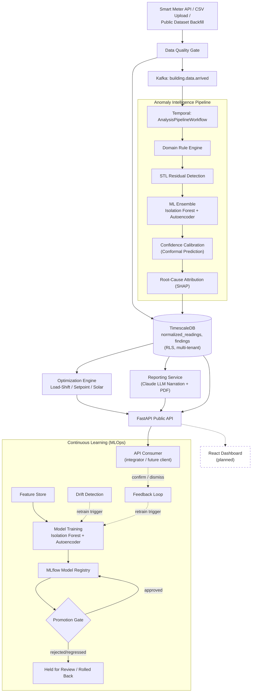

# CarbonSense

### AI-powered energy intelligence for building decarbonization — turning raw meter data into explainable, ROI-ranked action, continuously.

---

## 1. Overview

Buildings account for **37% of global CO₂ emissions**. The traditional tool for finding energy waste is a professional audit — expensive (₹4L–₹40L), infrequent (once every 3–5 years), and stale within months of delivery.

**CarbonSense replaces the episodic audit with always-on AI monitoring.** It ingests submeter and building-level energy data, runs it through a multi-layer anomaly intelligence pipeline, and produces a prioritized, ROI-ranked action plan — with every finding traceable back to a defensible, root-cause explanation rather than a black-box score.

It is built as a real multi-tenant SaaS platform: durable workflow orchestration, an event-driven ingestion backbone, a versioned ML model registry, and a public integrator API. A React-based dashboard is planned as a client of this same API — the platform is designed API-first so the dashboard, once built, adds a UI rather than new backend surface area.

## 2. Key Features

- **Layered anomaly detection** — a domain rule engine, STL statistical residual decomposition, and an Isolation Forest + Windowed Autoencoder ensemble each independently score a building's energy data; no single layer is "the detector."
- **Explainable, not black-box** — every finding carries a SHAP-based root-cause attribution and a conformal-prediction confidence band, so a facility manager or auditor sees *why* something fired, not just a score.
- **Drift detection & continuous learning** — a Mann-Kendall trend test flags model drift per building; retraining runs automatically on a calendar cadence, on drift, or once enough new feedback accumulates.
- **Governed model promotion** — every retrained model passes an automated evaluation gate (sample-size and anomaly-rate sanity checks, tiered human review) before it's promoted to "champion" in the registry, and is automatically demoted if its post-promotion false-positive rate regresses.
- **Counterfactual savings scenarios** — load-shift, HVAC setpoint adjustment, and solar-offset scenarios are modeled with quantified savings estimates for prioritization.
- **LLM-narrated reporting** — findings and scenarios are turned into plain-language reports (Claude), with a deterministic fallback narrator and PDF export.
- **Real dataset training pipeline** — models train on real public building energy data (Building Data Genome Project 2), not synthetic fixtures, flowing through the same ingestion → feature-engineering → training pipeline production data uses.
- **Multi-tenant by construction** — every table is tenant-isolated via PostgreSQL Row-Level Security, not application-layer filtering.
- **Durable pipeline execution** — the full analysis pipeline runs as a Temporal workflow, so a transient failure resumes rather than silently drops data.
- **Public integrator API** — a versioned FastAPI surface (ingestion, findings, scenarios, reports, tenant admin) is the single contract any client — internal or third-party integrator — consumes; there is no separate, undocumented internal path.

## 3. How CarbonSense Works

1. **Ingest** — meter data arrives via CSV upload, a smart-meter webhook, or a public dataset backfill, and passes through a Data Quality Gate (validation, gap-filling, outlier flagging) into canonical, tenant-scoped storage.
2. **Detect** — a Temporal-orchestrated pipeline runs the reading through the Domain Rule Engine, STL residual detection, and the ML Ensemble, then calibrates each result's confidence and attributes root cause.
3. **Explain** — every finding is persisted with an Explainability Bundle (contributing layers, rule citations, SHAP feature attribution) — never a bare anomaly score.
4. **Act** — the Optimization Engine models counterfactual scenarios (load-shift, setpoint changes, solar offset) and ranks them by estimated savings.
5. **Report** — findings and scenarios are narrated into a readable report and exported as a PDF, or consumed directly via the API.
6. **Learn** — facility-manager feedback (confirm/dismiss) and drift signals feed back into scheduled retraining, so the models serving a building keep improving with real usage instead of staying frozen at first deployment.

## 4. System Architecture



## 5. AI & MLOps Pipeline

CarbonSense's model lifecycle is a governed pipeline, not a one-off training script:

| Stage | What Happens |
|---|---|
| **Dataset ingestion** | Real public building energy data (Building Data Genome Project 2) and live tenant readings flow through the identical ingestion + Data Quality Gate path. |
| **Feature engineering** | A batch pipeline reuses the same STL, rule-engine, and feature-assembly logic the live pipeline runs, persisting engineered features to a dedicated, RLS-protected feature store. |
| **Training** | An Isolation Forest and a Windowed Autoencoder are trained per tenant/building on real feature history, with every run logging its training window, trigger, and metrics to MLflow. |
| **Evaluation & promotion gate** | A trained candidate is checked against sample-size and anomaly-rate sanity bounds, and a tiered human-review requirement, before its version is marked "champion" in the registry — a regressing candidate is rejected and logged, not promoted. |
| **Model registry** | MLflow tracks every version per `(tenant, building, model type)`, with alias-based promotion so the champion version is always an explicit, auditable state — the same registry inference will read from as serving is wired up to it. |
| **Continuous learning** | Retraining is triggered by a calendar cadence, a drift-detection event, or a feedback-volume threshold — all three run through the same Temporal-scheduled retraining workflow. |
| **Rollback** | A scheduled monitor checks each promoted model's post-promotion false-positive rate and automatically reverts the champion alias to the prior version if it regresses, logging the rollback for audit. |

## 6. Tech Stack

| Layer | Technology |
|---|---|
| API | FastAPI, Uvicorn, Pydantic |
| Frontend | React *(planned — not yet implemented; the API is designed to serve it directly)* |
| Orchestration | Temporal (durable, resumable workflows) |
| Event Backbone | Apache Kafka |
| Data Layer | TimescaleDB (PostgreSQL) with Row-Level Security |
| ORM / Migrations | SQLAlchemy (async) + Alembic |
| ML / Anomaly Detection | scikit-learn (Isolation Forest), PyTorch (Autoencoder), statsmodels (STL), pymannkendall (drift) |
| Explainability | SHAP, MAPIE (conformal prediction) |
| Model Registry & Tracking | MLflow |
| LLM Reporting | Anthropic Claude, WeasyPrint (PDF export) |
| Auth | PyJWT (JWT-based auth) |
| Observability | OpenTelemetry (tracing), structlog |
| Infrastructure | Docker, Terraform |
| Testing | pytest, pytest-asyncio, testcontainers |
| Lint / Type-check | Ruff, mypy (strict), Black |
| CI/CD | GitHub Actions |

## 7. Project Structure

```
apps/            → API gateway, Temporal worker, admin utilities
services/        → Anomaly Intelligence Platform layers + Optimization Engine
models/          → Model training, registry, evaluation, serving, feature store
pipelines/       → Dataset ingestion, feature engineering, and training pipelines
orchestration/   → Temporal workflows/activities, Kafka event definitions
database/        → Alembic migrations, DDL, RLS policies
shared/          → Cross-cutting: auth, config, logging, observability
infrastructure/  → Docker Compose (local dev), Terraform (tenant DB provisioning)
scripts/         → Bootstrap, migration, and maintenance scripts
tests/           → Unit, integration, security, and end-to-end tests
docs/            → PRD, TRD, ROADMAP, and architecture documentation
```

> **Planned:** `frontend/` — a React dashboard consuming the public API. Not yet present in this repository; the backend is API-first specifically so this can be added without touching existing service boundaries.

## 8. Installation & Local Setup

**Prerequisites:** Python 3.12+, Docker, a TimescaleDB instance.

```bash
# 1. Clone and enter the repo
git clone https://github.com/rniyati07/CarbonSense.git
cd CarbonSense

# 2. Create a virtual environment and install dependencies
python -m venv .venv
source .venv/bin/activate        # Windows: .venv\Scripts\activate
pip install -e ".[dev]"
pre-commit install

# 3. Configure environment variables
cp .env.example .env
# edit .env with real values (database, Kafka, Temporal, MLflow, API keys)

# 4. Start Temporal + Kafka (+ worker container)
docker compose -f infrastructure/docker/docker-compose.yml up -d

# 5. Start TimescaleDB (if not already running) and apply migrations
docker run -d --name carbonsense-db -p 5432:5432 \
  -e POSTGRES_USER=carbonsense -e POSTGRES_PASSWORD=changeme -e POSTGRES_DB=carbonsense \
  timescale/timescaledb:latest-pg16
alembic -c database/alembic.ini upgrade head

# 6. Run the API
uvicorn apps.api.main:app --reload

# 7. Run the Temporal worker (separate terminal)
python -m apps.worker.main

# 8. Verify the install
make lint
make test-unit
```

## 9. Future Scope

- **Graph-aware fault localization** — a graph neural network that models a building's submeter circuit topology, currently a research track validated against synthetic fault injection.
- **Cross-tenant output-distribution monitoring** — aggregate drift tracking across the tenant base to catch a model that's technically running but silently degrading.
- **Tier-differentiated promotion gating** — differentiated human-review requirements for freemium vs. enterprise/compliance tenants, pending a platform-wide false-positive-rate ceiling decision.
- **Expanded public dataset coverage** — extending real-dataset training beyond the current BDG2 slice to the full multi-site corpus and additional public sources (e.g. ASHRAE Great Energy Predictor III).

## 10. Contributors

- [likitha-thatikondla](https://github.com/likitha-thatikondla)
- [rniyati07](https://github.com/rniyati07)
- [rthi4115](https://github.com/rthi4115)

## 11. License

Proprietary. All rights reserved.
