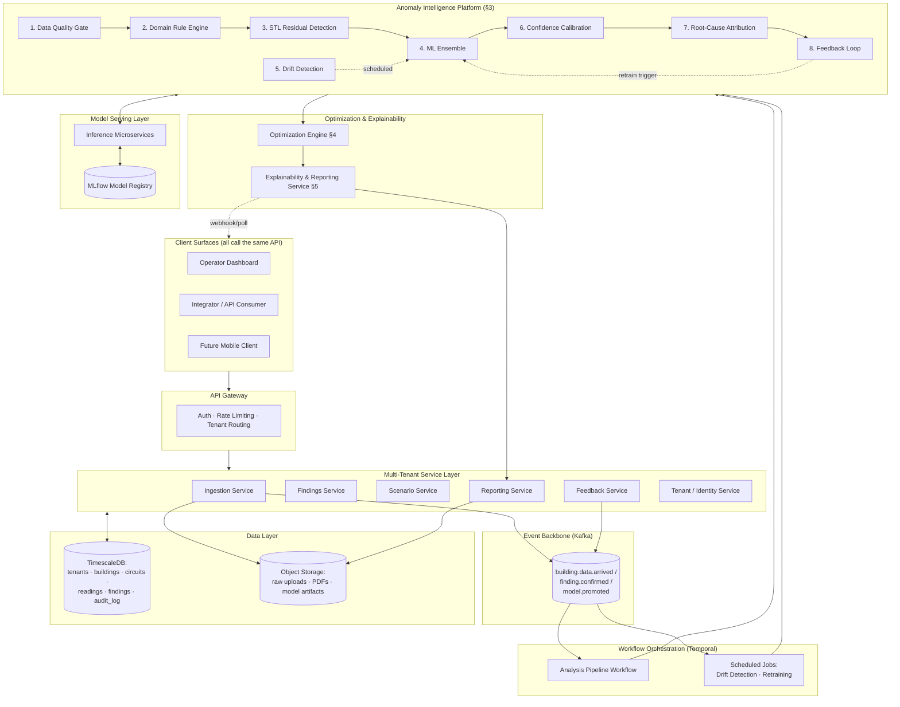

# CarbonSense — Technical Requirements Document

**Version:** 2.0
**Status:** Active Engineering & Research Planning
**Supersedes:** TRD v1.0 (hackathon MVP architecture — see Appendix A: Migration Map)
**Source of Truth for Scope:** PRD v2.0
**Document Owner:** Engineering
**Parallel Tracks:** Production SaaS Platform · IEEE Research Contribution (Graph-Aware Fault Localization)

---

## 1. System Architecture Overview

CarbonSense v2 is a multi-tenant, asynchronous, service-oriented platform. The hackathon-era model — a single synchronous request chain through four named agents, with orchestration logic living in the Streamlit frontend — does not survive contact with multi-tenancy, durability, or the requirement that a dashboard, an API integrator, and a future mobile client all get identical behavior from the backend. Orchestration must live in the backend, be restartable, be observable, and be agnostic to whoever is calling it.

### 1.1 Layered Architecture

| Layer | Responsibility |
|---|---|
| **API Gateway** | TLS termination, authentication, tenant-scoped rate limiting, request routing to service layer |
| **Multi-Tenant Service Layer** | Stateless service APIs (Ingestion, Findings, Scenario, Reporting, Feedback, Tenant/Identity) — each owns its data contract, none owns orchestration |
| **Event Backbone** | Durable event stream (new-data-arrived, finding-confirmed, model-promoted) decoupling ingestion from analysis |
| **Workflow Orchestration** | Durable, resumable execution of the multi-layer analysis pipeline, scheduled batch jobs (drift detection, retraining), and long-running research training jobs |
| **Model Serving Layer** | Versioned model registry + inference services for the ML Ensemble, Confidence Calibration, and (later) the GNN localization model |
| **Data Layer** | Tenant-isolated relational + time-series storage, object storage for raw uploads/artifacts/reports, audit log |

### 1.2 Orchestration Choice: Temporal

**Decision:** Temporal is the workflow orchestrator for the analysis pipeline and for scheduled ML jobs. Celery+Redis and a raw Kafka-consumer event-driven design were both considered and rejected as primary orchestrators, for reasons specific to this pipeline's shape:

- **The pipeline is a long-running, multi-step, partially-failable saga, not a fire-and-forget task.** A building's analysis run passes through 7+ sequential and partially-parallel layers (§3), several of which call external services (LLM API, calibration store) that can fail transiently. Temporal's durable execution model means a workflow resumes exactly where it failed without the application code needing to hand-roll state checkpointing — Celery gives you a task queue, not a resumable state machine; you'd rebuild Temporal's core value proposition by hand on top of it.
- **Human-in-the-loop steps are first-class, not bolted on.** The Feedback Loop (§3.8) means a workflow can be genuinely long-lived — waiting on a facility manager's confirm/dismiss action before a per-building retraining decision is finalized. Temporal's signal/query primitives model this directly; a Kafka-only design would require building an equivalent durable-wait mechanism from scratch.
- **Scheduled jobs (Drift Detection, retraining) need the same operational visibility as request-path workflows.** Temporal's cron workflows and the same dashboard/replay tooling cover both the real-time analysis path and the batch jobs, rather than maintaining a separate cron/Airflow stack alongside the request-path orchestrator.
- **Fallback if Temporal's operational overhead exceeds the team's ops maturity pre-PMF:** start with **Temporal Cloud** (managed control plane) rather than self-hosting the Temporal server cluster. If even the managed offering proves too heavy before product-market fit, fall back to **Celery + Redis** for the linear pipeline steps, accepting that human-in-the-loop waits and resumable-from-failure semantics must be hand-built on top — a real cost, not a free substitution. This is documented as a deliberate, reversible downgrade, not a silent scope cut (see §12).

The event backbone (Kafka, or a managed equivalent like Amazon MSK / Confluent Cloud) sits *upstream* of Temporal: ingestion services publish a `building.data.arrived` event; a lightweight event consumer starts the corresponding Temporal workflow execution. This keeps ingestion decoupled from analysis — a burst of CSV uploads doesn't block on pipeline capacity, and a slow pipeline doesn't block ingestion acks.

### 1.3 Architecture Diagram



This diagram is the v2 replacement for v1's single synchronous chain (`CSV → SensorAgent → AnomalyAgent → OptimizerAgent → NarratorAgent → PDF/dashboard`). The agent names are gone; the capabilities they represented are now distributed across services, an 8-layer detection platform, and an orchestrator that any client can trigger identically.

---

## 2. Data Architecture

### 2.1 Multi-Tenant Isolation Model: Hybrid (Row-Level Default, Schema-per-Tenant on Contract)

**Decision:** Default tenants run on **shared tables with Postgres Row-Level Security (RLS)** enforced at the database layer; customers whose contract requires dedicated physical isolation (typically enterprise/compliance-tier, per PRD §4.2 and §4.4) are provisioned a **dedicated schema** (or, for the largest accounts, a dedicated database) via the same Terraform module.

**Why not pure schema-per-tenant for everyone:** The freemium/SME motion (PRD §8.1) implies a long tail of small, low-volume tenants. Schema-per-tenant at that scale means schema-migration fan-out (one DDL change × thousands of schemas), connection-pool exhaustion (each schema effectively needs its own pooled connections at scale), and operational tooling that has to reason about "which of N schemas" for every maintenance task. None of that cost buys the freemium tenant anything they're paying for.

**Why not pure row-level isolation for everyone:** Enterprise and compliance buyers (PRD §4.2, §4.4) are explicitly buying defensibility — "isolation enforced by the platform itself rather than relying solely on application-layer query discipline" is a direct PRD §6 requirement, and an external ESG auditor's risk assessment of "your data lives in the same tables as every other customer's, protected by a `WHERE tenant_id = ?` clause and an RLS policy" is a materially harder sell than "your data lives in a schema/database provisioned and access-controlled specifically for you."

**Enforcement detail:** Every tenant-scoped table carries a `tenant_id` column; Postgres RLS policies are mandatory on every such table (`ENABLE ROW LEVEL SECURITY`, no superuser bypass role used by application connections). This means a bug in application-layer query construction — the classic "forgot the WHERE clause" failure mode — fails closed at the database layer rather than leaking data. The schema-per-tenant tier reuses the identical table DDL; only the postgres `search_path` / connection target differs. One schema definition, two isolation postures.

### 2.2 Canonical Normalized Schema

The v1 SensorAgent output schema (timestamp-aligned, hourly-resampled kWh with derived peak/off-peak and baseline fields) is **sound and reused as a versioned component** — it becomes the contract that the Data Quality Gate (§3.1) emits into, not a one-off script's output shape. It is versioned (`normalized_reading_v1`) because the ML Ensemble, STL Residual Detection, and the GNN research track (§8) all depend on this shape staying stable or migrating deliberately.

```sql
-- Tenancy & topology
CREATE TABLE tenants (
    tenant_id UUID PRIMARY KEY DEFAULT gen_random_uuid(),
    name TEXT NOT NULL,
    isolation_tier TEXT NOT NULL CHECK (isolation_tier IN ('shared_rls','dedicated_schema','dedicated_db')),
    created_at TIMESTAMPTZ NOT NULL DEFAULT now()
);

CREATE TABLE buildings (
    building_id UUID PRIMARY KEY DEFAULT gen_random_uuid(),
    tenant_id UUID NOT NULL REFERENCES tenants(tenant_id),
    name TEXT NOT NULL,
    building_type TEXT NOT NULL,           -- office | retail | mixed_use | industrial ...
    timezone TEXT NOT NULL,
    climate_zone TEXT,                     -- used for cold-start prior clustering, §2.4
    cold_start BOOLEAN NOT NULL DEFAULT TRUE,
    onboarded_at TIMESTAMPTZ NOT NULL DEFAULT now()
);
ALTER TABLE buildings ENABLE ROW LEVEL SECURITY;

CREATE TABLE submeter_circuits (
    circuit_id UUID PRIMARY KEY DEFAULT gen_random_uuid(),
    tenant_id UUID NOT NULL REFERENCES tenants(tenant_id),
    building_id UUID NOT NULL REFERENCES buildings(building_id),
    parent_circuit_id UUID REFERENCES submeter_circuits(circuit_id), -- electrical hierarchy edge
    panel_id TEXT,                          -- same-panel grouping, secondary edge type (§8.2)
    floor TEXT,                             -- same-floor grouping, secondary edge type (§8.2)
    circuit_type TEXT NOT NULL,             -- hvac | lighting | plug_load | main_feed ...
    label TEXT
);
ALTER TABLE submeter_circuits ENABLE ROW LEVEL SECURITY;

-- Time-series (TimescaleDB hypertable)
CREATE TABLE normalized_readings (
    tenant_id UUID NOT NULL,
    circuit_id UUID NOT NULL REFERENCES submeter_circuits(circuit_id),
    ts TIMESTAMPTZ NOT NULL,
    kwh DOUBLE PRECISION,
    is_peak_hour BOOLEAN,
    rolling_baseline_kwh DOUBLE PRECISION,
    data_quality_status TEXT NOT NULL DEFAULT 'pass',  -- pass | degraded | quarantined (§3.1)
    schema_version TEXT NOT NULL DEFAULT 'normalized_reading_v1',
    PRIMARY KEY (tenant_id, circuit_id, ts)
);
SELECT create_hypertable('normalized_readings', 'ts');
ALTER TABLE normalized_readings ENABLE ROW LEVEL SECURITY;

-- Findings & audit
CREATE TABLE findings (
    finding_id UUID PRIMARY KEY DEFAULT gen_random_uuid(),
    tenant_id UUID NOT NULL,
    building_id UUID NOT NULL,
    circuit_id UUID,
    layer_origin TEXT NOT NULL,             -- which §3 layer(s) fired, comma-separated
    detected_at TIMESTAMPTZ NOT NULL DEFAULT now(),
    evidence_window TSTZRANGE NOT NULL,
    confidence DOUBLE PRECISION,            -- output of Confidence Calibration, §3.6
    status TEXT NOT NULL DEFAULT 'open',    -- open | confirmed | dismissed
    explainability_bundle JSONB NOT NULL    -- contract defined in §3.7
);
ALTER TABLE findings ENABLE ROW LEVEL SECURITY;

CREATE TABLE feedback_labels (
    feedback_id UUID PRIMARY KEY DEFAULT gen_random_uuid(),
    tenant_id UUID NOT NULL,
    finding_id UUID NOT NULL REFERENCES findings(finding_id),
    action TEXT NOT NULL CHECK (action IN ('confirmed','dismissed')),
    actor TEXT NOT NULL,
    created_at TIMESTAMPTZ NOT NULL DEFAULT now()
);
ALTER TABLE feedback_labels ENABLE ROW LEVEL SECURITY;

CREATE TABLE audit_log (
    audit_id UUID PRIMARY KEY DEFAULT gen_random_uuid(),
    tenant_id UUID NOT NULL,
    event_type TEXT NOT NULL,
    entity_id UUID,
    payload JSONB NOT NULL,
    model_version TEXT,
    occurred_at TIMESTAMPTZ NOT NULL DEFAULT now()
);
-- audit_log is append-only: no UPDATE/DELETE grants for the application role
ALTER TABLE audit_log ENABLE ROW LEVEL SECURITY;
```

RLS policies (one pattern, applied per table) take the form:

```sql
CREATE POLICY tenant_isolation ON normalized_readings
    USING (tenant_id = current_setting('app.current_tenant_id')::uuid);
```

The application sets `app.current_tenant_id` once per request from the authenticated token's tenant claim — never from a client-supplied header alone (§7.2).

### 2.3 Time-Series Store: TimescaleDB over InfluxDB

**Decision:** TimescaleDB (Postgres + the Timescale extension), not InfluxDB or a separate dedicated TSDB.

**Justification:** This platform's hardest non-negotiable requirement is multi-tenant isolation enforced at the storage layer (§6), and that requirement is most naturally satisfied by Postgres RLS — a mature, audited, SQL-standard mechanism. InfluxDB has no equivalent first-class row-level security model, and the platform also needs relational joins that are routine here but awkward in a pure time-series store: `findings` joins to `submeter_circuits` joins to `buildings` joins to `tenants`, with audit-log retention, model-registry pointers, and feedback labels all living in the same transactional boundary as the time-series data. Running one engine for both reduces operational surface area (one backup/restore story, one HA story, one access-control model) at the cost of some write-throughput ceiling relative to a purpose-built TSDB — an acceptable trade at the platform's projected scale (§9.2), revisited if ingestion volume from real-time smart-meter API integration (PRD §5.1) materially exceeds Timescale's comfortable range.

### 2.4 Cold-Start Strategy

COMBED's reality — one instrumented building, 200+ submeter circuits, ~1 month of data — is treated as a **permanent platform fact**, not a temporary data-availability gap: every newly onboarded building starts in an analogous cold-start state, and the architecture must handle that as a steady-state condition, not an edge case that disappears once "real" data arrives.

- **`buildings.cold_start` flag** governs pipeline behavior explicitly (not implicitly via "the model happens to be unreliable with little data"). While `cold_start = TRUE`:
  - STL Residual Detection (§3.3) and the ML Ensemble (§3.4) run in a **reduced-confidence mode**: their outputs are computed but down-weighted heavily by Confidence Calibration (§3.6), and findings they alone produce are surfaced with an explicit "low confidence — building still establishing baseline" label rather than suppressed silently.
  - The Domain Rule Engine (§3.2) — which depends on declared building parameters (occupancy schedule, building type), not learned history — is the primary source of high-confidence findings during this period, exactly because its findings are not contingent on accumulated history.
- **Pretrained priors via building-type clustering:** new buildings are seeded with ML Ensemble initialization parameters (Isolation Forest contamination prior, Autoencoder weight initialization) drawn from a per-`(building_type, climate_zone)` cluster model trained across consenting tenants' aggregate, de-identified statistics — never raw per-tenant readings (§3.8 specifies the exact non-leakage mechanism). This is the architectural seed for the transfer-learning approach the research track also needs (§8.4).
- **Exit criterion:** a building leaves cold-start mode once it accumulates a minimum history window (calibrated per building type, not a single global constant) sufficient for the Confidence Calibration layer's per-building calibration set (§3.6) to clear its minimum-sample threshold — this is a data-driven exit, not a fixed calendar cutoff.

### 2.5 Data Retention & Privacy

- **Encryption:** TLS 1.2+ in transit everywhere; encryption at rest via TimescaleDB's underlying disk-level encryption and server-side encryption on object storage (raw uploads, generated reports, model artifacts).
- **Retention:** Raw normalized readings and findings are retained for an **audit-log-driven minimum period**, with the exact duration a Legal/Compliance decision (PRD §11, OQ-5) rather than an engineering default — flagged explicitly as an open gap in Appendix B. The architecture supports per-tenant-configurable retention (a `tenants.retention_policy` field, not a single hardcoded constant), because enterprise/compliance contracts and jurisdictional rules (PRD §9) are expected to diverge.
- **Deletion:** Tenant-initiated deletion requests cascade through `buildings → submeter_circuits → normalized_readings → findings → feedback_labels`, but **never** delete from `audit_log`, which is append-only by design (no delete grants) — a deletion event is itself logged, not a literal erasure of audit history, consistent with the audit-defensibility requirement in PRD §6.

---

## 3. The Anomaly Intelligence Platform

This is the architectural centerpiece of the system — a production pipeline of eight components (the PRD's "seven layers" plus the Feedback Loop, which is tightly coupled enough to the ML Ensemble's lifecycle that it is specified here rather than as a separate capability). No single layer is "the detector." A finding's confidence is a function of which layers fired and how they agree.

### 3.1 Data Quality Gate

**Inputs:** Raw ingested rows (CSV-uploaded or smart-meter-API-delivered), per circuit.
**Outputs:** `normalized_readings` rows with `data_quality_status ∈ {pass, degraded, quarantined}`, plus a per-ingestion-batch quality report surfaced to the customer.

**Internal logic (reused as a component, not redesigned):** The v1 normalization pipeline's column-alias matching, timezone alignment, outlier-guarding, and gap-handling rules are sound engineering and are carried forward unchanged as the implementation inside this Gate — cited here, not rewritten. What's new in v2 is formalizing this logic as its own service with a real output contract, rather than an inline preprocessing step inside a single script:

- **Stuck-at-value detection:** rolling-window variance ≈ 0 over a duration threshold (calibrated per circuit type — a stuck-at on a `main_feed` circuit is a bigger deal than on a single plug load) flags sensor fault, distinct from genuinely-idle equipment (which the Domain Rule Engine and ML Ensemble are responsible for interpreting, not this layer).
- **Dropout detection:** gap duration vs. an expected reporting interval (per data source — API push interval vs. CSV export granularity differ) beyond a threshold marks the gap window `quarantined`.
- **Implausible-value bounds:** physically-informed min/max per `circuit_type` (e.g., a lighting circuit reporting consumption consistent with an HVAC compressor) — bounds are a versioned, editable table, not a magic number in code.
- **Schema drift detection:** column-hash/type fingerprinting on each new ingestion source; a drift triggers `degraded` status and a customer-facing notification rather than a silent reinterpretation of columns.

**Handoff:** Publishes `building.data.arrived` to the event backbone once a batch clears the gate at `pass` or `degraded` (a `quarantined`-only batch does not trigger downstream analysis and instead raises a data-quality alert to the tenant).

### 3.2 Domain Rule Engine

**Inputs:** `normalized_readings` (pass/degraded), building metadata (declared occupancy schedule, building type).
**Outputs:** Rule-fired findings (deterministic, not probabilistic) with explicit rule citations.

**Internal logic:** A declarative, versioned ruleset — encoded as YAML rule definitions evaluated by a small Python rule-evaluation service — encodes deterministic, ASHRAE-Guideline-36-style fault-detection-and-diagnosis (FDD) patterns: after-hours HVAC operation against the building's declared occupancy profile, weekend vampire-load thresholds, scheduling violations. Example rule definition:

```yaml
rule_id: hvac_after_hours_v3
version: 3
effective_date: 2026-03-01
citation: "ASHRAE Guideline 36 — HVAC scheduling FDD pattern"
applies_to: circuit_type == "hvac"
condition: >
  kwh > building.declared_unoccupied_baseline * 1.4
  AND NOT within(building.occupancy_schedule, ts)
severity: medium
```

**Why rules are versioned independently from ML models:** Regulatory defensibility (PRD §4.4, §6) requires that an auditor reviewing a finding from six months ago can determine *exactly* which deterministic logic produced it, on what version, authored and reviewed by whom — and that this answer is unaffected by an ML model having been retrained three times since. Rules change via reviewed pull request and an explicit version bump in a `rule_registry` table (rule_id, version, effective_date, author, citation); ML models change on a data-driven retraining cadence (§6). Conflating these two version histories — e.g., bundling a rule change into the same deploy as a model retraining — would make "was this finding from a rule or a model, and which version of either" an unanswerable question during an audit, which is precisely the failure mode the Domain Rule Engine exists to prevent for its class of findings.

**Handoff:** Rule-fired findings are written directly to `findings` (status `open`) and also passed forward as input context to Root-Cause Attribution (§3.7), since "which rule(s) fired" is part of that layer's output contract even for findings the rule engine alone produced.

### 3.3 Statistical Residual Detection (STL)

**Inputs:** `normalized_readings` time series per circuit/building, `building_calendar` (holidays, declared closures).
**Outputs:** Residual z-scores per reading, flagged anomalies where `|z| > threshold`.

**Internal logic:** STL decomposition (`statsmodels.tsa.seasonal.STL`) separates trend, seasonal, and residual components; anomalies are flagged on residual magnitude relative to the building's *own* decomposed baseline — "unusual for this building, this time of year, this day type," not a raw-value threshold. **Calendar-awareness is a hard requirement in v2, not deferred:** a `building_calendar` table (tenant-scoped, supporting both a public-holiday-API import per locale and customer-uploaded closures) feeds the day-type classification the decomposition conditions on, so a holiday closure doesn't get scored as an anomalous low-consumption day.

**Handoff:** Anomaly candidates pass to the ML Ensemble stage as additional engineered features (residual magnitude, day-type classification) — STL output is consumed, not discarded, by the next layer.

### 3.4 ML Ensemble (Isolation Forest + Windowed Autoencoder)

**Inputs:** Engineered feature set per circuit-window (`feature_set_v1`: rolling statistics, STL residuals, calendar features, rule-fire indicators).
**Outputs:** Per-window anomaly scores from both models.

**Internal logic:** Isolation Forest (tree-based, catches global outliers cheaply) and a windowed Autoencoder (reconstruction-error-based, catches pattern-level anomalies a tree-based method misses — e.g., a circuit that's individually within normal bounds but exhibits an abnormal *shape* over a window) run as two independent scorers specifically so their blind spots don't overlap, per PRD §5.2 Layer 4's explicit guarantee.

**Infrastructure (the v1→v2 upgrade that matters most here):** This is no longer a one-off `sklearn.fit()` call inside a script. Training is a **scheduled Temporal workflow**, per tenant and per building (never pooled across tenants — §3.8 specifies why), producing artifacts logged to an **MLflow model registry** under a `models:/{tenant_id}/{building_id}/ml_ensemble/{version}` URI convention. Inference is served by a lightweight model-serving microservice that loads the currently-promoted version per building from the registry — see §6 for promotion gating.

**Handoff:** Anomaly scores pass to Confidence Calibration (§3.6) alongside STL residuals and rule-fire context — none of these signals is individually sufficient to surface a finding to a user without calibration.

### 3.5 Drift Detection

**Inputs:** Rolling efficiency ratio (actual consumption / model-predicted baseline) per building, computed over a trailing window.
**Outputs:** `drift_status` per building (`stable | drifting`), with trend direction and magnitude.

**Internal logic:** A Mann-Kendall trend test on the rolling efficiency ratio detects monotonic drift (renovation, occupancy change, equipment replacement, seasonal regime shift) that would otherwise either silently degrade detection quality or bury the customer in stale-baseline false positives.

**Infrastructure — explicitly out of the real-time request path:** This runs as a **scheduled Temporal cron workflow** (e.g., nightly per building), not as a step inside the live analysis pipeline triggered by new data arrival. Drift is a slow-moving signal; computing it on every request would be wasted work and would couple a batch-appropriate computation to a latency-sensitive path.

**Handoff:** A `drifting` status does two things, per PRD §6: (a) raises a customer-facing notice that the building's baseline may be stale, and (b) publishes a `model.drift.detected` event that is one of the retraining triggers in §6 — drift detection feeds MLOps, it does not retrain anything itself.

### 3.6 Confidence Calibration (Conformal Prediction)

**Inputs:** ML Ensemble scores, STL residual magnitudes, rule-fire context, building's `cold_start` status.
**Outputs:** A calibrated confidence interval/percentage per candidate finding — not an arbitrary score.

**Internal logic:** Conformal prediction wraps the upstream scorers' raw outputs into statistically grounded nonconformity-based confidence bounds, using a held-out per-building calibration set.

**Calibration data requirement and per-tenant maintenance:** Each building maintains a rolling calibration set drawn from its own most-recent confirmed/dismissed feedback labels (§3.8). Until a building clears a **minimum calibration-sample threshold**, the layer defaults to conservative, wide confidence bands — this is the concrete mechanism behind the cold-start "reduced-confidence mode" described in §2.4, not a separate ad hoc rule. The calibration set is refreshed on a rolling basis (oldest labels age out as new ones arrive) so calibration tracks a building's *current* behavior rather than a frozen historical slice — directly relevant when Drift Detection (§3.5) has flagged that the building's behavior has shifted.

**Handoff:** Calibrated confidence is written onto the `findings.confidence` field and is a required input to Root-Cause Attribution's output contract (§3.7) — every finding a user sees carries this number; "low confidence" is a first-class, honestly-communicated state per PRD §5.2 Layer 6, not a withheld finding.

### 3.7 Root-Cause Attribution (SHAP)

**Inputs:** ML Ensemble feature inputs and scores, rule-fire context, STL residual context, calibrated confidence.
**Outputs:** A structured **Explainability Bundle** — the contract this layer must produce for both the downstream NarratorAgent-pattern LLM call (§5) and the end-user-facing explainability UI.

**Internal logic:** SHAP values computed against the ML Ensemble's feature inputs identify which specific engineered features drove a given anomaly score; this is combined with an explicit listing of which Domain Rule(s) fired (if any) and which STL residual threshold was crossed (if any), so a finding's explanation is never solely "the model said so."

**Output contract (consumed downstream, and persisted in `findings.explainability_bundle`):**

```json
{
  "finding_id": "uuid",
  "contributing_layers": ["domain_rule", "ml_ensemble", "stl_residual"],
  "top_features": [
    {"feature": "after_hours_kwh_ratio", "shap_value": 0.41, "plain_language": "Energy use after declared business hours was 40% above the building's normal pattern"},
    {"feature": "weekend_floor_load", "shap_value": 0.19, "plain_language": "Weekend baseline consumption did not drop as expected"}
  ],
  "rule_citations": [
    {"rule_id": "hvac_after_hours_v3", "version": 3, "citation": "ASHRAE Guideline 36 — HVAC scheduling FDD pattern"}
  ],
  "confidence_band": {"lower": 0.62, "upper": 0.81, "method": "conformal_prediction"},
  "evidence_window": {"start": "2026-06-01T22:00:00+05:30", "end": "2026-06-02T05:00:00+05:30"}
}
```

**Handoff:** This bundle — not summary statistics, not a bare anomaly score — is the required input to both the Optimization Engine's scenario justification (§4) and the Explainability & Reporting Service's LLM call (§5). This is the specific upgrade the PRD requires over v1: action plans must now be causally grounded, not templated prose layered over numbers.

### 3.8 Feedback Loop

**Inputs:** Facility-manager confirm/dismiss actions on findings, taken in the primary review workflow (not a separate feedback form, per PRD §5.5).
**Outputs:** `feedback_labels` rows; retraining-trigger events; calibration-set updates (§3.6).

**Internal logic and the cross-tenant leakage guard (the part that matters most here):** Confirm/dismiss labels feed two things, and the architecture must keep them strictly separate:

1. **Per-building/per-tenant retraining:** A `feedback_label` insert increments a per-building counter; once it crosses a threshold (§6), a retraining-eligible signal is published. The retraining Temporal workflow that consumes it is **parameterized with `tenant_id` as a workflow input**, and its training-data query runs through the same RLS-enforced connection any other tenant-scoped query would — meaning a misconfigured or buggy retraining job cannot pull another tenant's rows even if it tried, because the database itself, not application discipline, is the enforcement point (consistent with §2.1).
2. **Cross-building cold-start priors (§2.4):** Aggregation across tenants for building-type-clustered priors is permitted **only** on anonymized, de-identified aggregate statistics (e.g., "buildings of type=office, climate_zone=tropical have a median after-hours-ratio of X") — never on raw per-tenant feedback rows or raw readings — and **only** for tenants whose contract includes an explicit, audited opt-in consent flag for contributing to shared aggregate priors. This consent flag lives on the `tenants` table and is checked by the aggregation job before a tenant's data is included in any cross-tenant computation; the check is logged to `audit_log`.

**Handoff:** Retraining-eligible events and drift events (§3.5) are the two triggers for the MLOps retraining pipeline (§6); the Feedback Loop itself does not retrain anything — it signals eligibility and supplies labeled data.

---

## 4. Optimization Engine

The v1 OptimizerAgent's scenario-modeling logic (load-shifting, setpoint adjustment, solar offset, via `scipy.optimize`) is sound and is carried forward — generalized into a **standalone service** with a versioned scenario-model catalog, rather than a step hardcoded into a single pipeline script.

**Service boundary:** The Optimization Engine is callable two ways: (a) synchronously via the API for a fast LP solve on a single building/scenario, and (b) as a Temporal workflow step within the main analysis pipeline, when scenario modeling is part of a full building analysis run rather than an ad hoc "what-if" query.

**The required upgrade — scenario justification grounded in Root-Cause Attribution:** Every generated scenario must reference the specific `finding_id`(s) whose Explainability Bundle (§3.7) justifies it. A load-shift recommendation is not "the optimizer noticed peak-hour usage is high" — it cites the specific after-hours-HVAC finding (with its rule citation and SHAP features) that makes load-shifting the *specific, evidenced* recommendation for *this* building, not a generic template.

**Versioned scenario catalog (extensible, per PRD §5.3 — not fixed at three):**

| Scenario Model | Version | Method |
|---|---|---|
| `load_shift_v1` | 1 | LP (time-of-use tariff arbitrage on peak-hour load identified by justifying findings) |
| `setpoint_adjustment_v1` | 1 | Heuristic + LP (HVAC setpoint delta vs. ASHRAE-referenced consumption-per-degree factor) |
| `solar_offset_v1` | 1 | Irradiance-lookup-informed offset estimate, gated on building having usable rooftop/location data |

**Output contract:**

```json
{
  "scenario_id": "uuid",
  "scenario_model": "load_shift_v1",
  "model_version": 1,
  "building_id": "uuid",
  "justifying_finding_ids": ["uuid-of-hvac-after-hours-finding"],
  "baseline_kwh": 18400,
  "optimized_kwh": 15200,
  "baseline_emissions_kg_co2": 14904,
  "optimized_emissions_kg_co2": 12312,
  "pct_reduction": 17.4,
  "confidence_band": {"lower_pct": 12.0, "upper_pct": 23.0},
  "estimated_annual_savings_inr": 89600,
  "payback_months": 0,
  "bounds_check": "passed"
}
```

**Bounds enforcement (carried forward from v1's risk mitigation, now a hard service-level invariant):** Savings estimates are clamped to a physically plausible range and validated against reference cases before being returned; an out-of-bounds result is rejected at the service layer and logged as a model-quality incident, not silently clipped and returned — per PRD §5.3, "an implausible scenario output is a trust failure, not a minor bug."

**Portfolio aggregation:** The same service supports a portfolio-level call signature (multiple `building_id`s, scenario rolled up across all) for the enterprise persona (PRD §4.2) — this is a query-shape addition, not a separate service, since the underlying LP formulation is per-building regardless of how many buildings a single request asks about.

---

## 5. Explainability & Reporting Service

This is now a formal, standalone service consuming the Root-Cause Attribution output contract (§3.7) and the Optimization Engine output contract (§4) — not an internal debugging tool, per PRD §5.4.

### 5.1 What's preserved from v1, and what's required to change

**Preserved structurally unchanged:** The NarratorAgent pattern's core engineering shape — structured-JSON-in/JSON-out LLM call, schema validation on the response, retry-once-then-fallback-to-templated-output if validation fails — is sound and is reused as-is. This is genuinely good engineering and the rewrite does not touch it.

**Required upgrade:** The input to the LLM call is no longer summary statistics (anomaly counts, kWh deltas). It is now the full Explainability Bundle (§3.7) plus the Optimization scenario contract (§4) — meaning the system prompt itself must change to require the model to *cite* the SHAP features and rule citations it was given, and explicitly forbid inventing causal claims not present in the structured input. This is the specific mechanism that makes generated action plans causally grounded rather than templated prose over numbers.

### 5.2 System Prompt (Draft)

```
You are CarbonSense's reporting assistant. You convert structured building-energy
findings into a plain-language Carbon Action Plan for a facility manager who is not
a data scientist.

You will receive a JSON payload containing:
- One or more findings, each with an Explainability Bundle (contributing layers,
  top SHAP features with plain-language descriptions, rule citations if any,
  a confidence band, and an evidence window).
- One or more optimization scenarios, each explicitly linked to the finding_id(s)
  that justify it.

HARD RULES — these are not stylistic preferences, they are correctness requirements:
1. Every action you recommend MUST cite the specific finding(s) and feature(s) or
   rule(s) from the input that justify it. Do not generalize beyond what the input
   evidence supports.
2. Never state a causal claim ("this is happening because...") that is not directly
   supported by a top_feature or rule_citation in the input. If the input's evidence
   is weak or the confidence_band is wide, say so explicitly in plain language
   ("this finding has lower confidence because...") rather than writing confidently
   regardless of the underlying uncertainty.
3. Do not invent specific numbers. Only use kWh, cost, and CO2 figures present in
   the input payload.
4. If a finding's contributing_layers includes only "ml_ensemble" with no rule
   citation, describe it as a statistical pattern, not a confirmed mechanism — do
   not narrate a specific equipment failure unless a rule or feature explicitly
   supports that level of specificity.

OUTPUT FORMAT — respond with ONLY valid JSON matching this schema, no preamble:
{
  "narrative_summary": "<=100 words, plain language, references confidence honestly",
  "actions": [
    {
      "title": "string",
      "description": "<=50 words, plain language",
      "justifying_finding_ids": ["uuid", ...],
      "estimated_co2_saved_kg_per_year": number,
      "estimated_savings_inr_per_year": number,
      "effort_level": "Low" | "Medium" | "High",
      "payback_months": number,
      "confidence_note": "string describing confidence honestly, derived from confidence_band"
    }
  ]
}

If you cannot produce valid JSON matching this schema from the given input, return
exactly: {"error": "schema_validation_failed"}
```

### 5.3 Retry-and-Fallback (preserved from v1)

1. Call the LLM with the structured payload above.
2. Validate the response against the JSON schema.
3. On validation failure: retry once with an added instruction emphasizing the schema.
4. On second failure: fall back to a deterministic, templated narrative populated directly from the Optimization Engine and Explainability Bundle fields (no LLM) — the facility manager still receives a complete, accurate, if less fluent, action plan. This fallback path is tested as a first-class code path, not an untested escape hatch (§11).

### 5.4 Service Contracts

**API-level contract (what an integrator receives):** A JSON "Explainability Bundle + Action Plan" response from the Findings/Reporting API (§7), traceable per-field back to the underlying finding, its confidence calibration, and its root-cause attribution — per PRD §5.4's defensibility requirement.

**Generated report contract (PDF/UI):** The exportable PDF is an explicitly downstream *rendering* of the same data the in-product view shows — generated by a Reporting microservice (WeasyPrint, retained from v1 as a rendering technology, no longer coupled to a Streamlit-Cloud deployment target) that consumes the identical Action Plan JSON the API returns. There is one source of truth for "what does this report say"; the PDF and the in-product view are two templates over the same object, not two independently maintained artifacts.

---

## 6. MLOps & Model Lifecycle

This section did not exist in v1 and is now load-bearing — per-tenant model management is core platform infrastructure (PRD §5.6), not an operational afterthought.

### 6.1 Model Registry & Versioning

**MLflow** serves as the model registry. URI convention: `models:/{tenant_id}/{building_id}/{layer}/{version}` for the ML Ensemble (§3.4) and, once promoted from research, the GNN localization model (§8.5). Every promoted version records: training data window, training trigger (cadence / drift / feedback-volume), evaluation metrics at promotion time, and the promoting actor (automated gate or human reviewer) — satisfying the audit-log retention requirement (PRD §6) at the model layer, not just the findings layer.

### 6.2 Training Pipeline & Retraining Triggers

Training runs as a **Temporal scheduled workflow**, parameterized per `(tenant_id, building_id)` — never pooled across tenants (§3.8). Three triggers, any of which schedules a retraining run:

1. **Calendar cadence** — a default periodic retrain (e.g., monthly), giving every building a minimum refresh rate regardless of other signals.
2. **Drift-detection trigger** — a `model.drift.detected` event (§3.5) schedules an out-of-cycle retrain rather than waiting for the next calendar slot.
3. **Feedback-volume trigger** — crossing a minimum new-labeled-feedback threshold (§3.8) schedules a retrain so a building's model benefits from accumulated confirm/dismiss signal promptly rather than only on the calendar.

### 6.3 Evaluation Gates Before Promotion

A retrained candidate is evaluated in **shadow mode** against the building's held-out labeled feedback set before promotion:

- **Must not regress** the false-positive rate beyond the platform-wide ceiling defined in PRD §8.4, measured against the currently-serving model on the same held-out set.
- **Human review gate** applies to a tenant's first N promotions (calibrated by tier — freemium tenants may default to fully automated gating sooner than enterprise/compliance tenants, where a human review step is retained longer given the higher trust bar).
- A candidate that fails the gate is logged (model version, metrics, reason for rejection) and does not get served; the previously-promoted version continues serving unchanged.

### 6.4 Rollback

The registry retains the last K promoted versions per building in a hot-swappable state. An **automatic rollback** trigger fires if the post-promotion false-positive rate, monitored over a defined post-promotion window, spikes beyond the ceiling — the serving layer reverts to the prior version without waiting for a human to notice, with the rollback event itself logged to `audit_log` and surfaced to the on-call engineering rotation.

### 6.5 Monitoring for Silent Degradation

Beyond the data-drift signal in §3.5 (which monitors the *input* distribution), the model layer separately monitors **output** distribution drift — the aggregate statistics of what the currently-serving model is predicting, across the tenant base, not just per building. A model that's technically still running but has started producing a systematically shifted score distribution (a "silent" failure mode that doesn't trip a hard error) is caught by tracking these aggregate output statistics as an ongoing platform-health metric (PRD §6), with alerting thresholds owned jointly by Engineering and Data Science.

---

## 7. API Architecture

The v1 API contract (FastAPI endpoints called synchronously by a Streamlit frontend, with ad hoc inter-agent JSON passed in-process) is replaced by a **versioned, integrator-facing public API** — the dashboard, an integrator (PRD §4.3), and any future client all consume the identical surface.

### 7.1 Core Endpoint Groups

| Group | Purpose |
|---|---|
| **Ingestion API** (`/v1/ingestion`) | CSV upload, smart-meter API webhook registration, ingestion batch status |
| **Findings API** (`/v1/findings`) | Retrieve findings + Explainability Bundles, filter by building/status/confidence |
| **Scenario API** (`/v1/scenarios`) | Request and retrieve optimization scenarios, single-building or portfolio |
| **Reporting API** (`/v1/reports`) | Generate/retrieve exportable reports (PDF or structured JSON) |
| **Feedback API** (`/v1/feedback`) | Confirm/dismiss findings |
| **Tenant/Admin API** (`/v1/tenant`) | Tenant and building CRUD, API key management, sandbox provisioning |

### 7.2 Authentication, Tenancy, and Rate Limiting

- **Auth:** OAuth2 client-credentials flow for server-to-server integrators; short-lived JWTs for the dashboard's user-facing sessions. Every token carries a `tenant_id` claim.
- **Tenant scoping:** Requests are scoped to the tenant in the **validated token claim**, never trusted from a client-supplied header alone — an `X-Tenant-ID` header, if present, is checked for consistency against the token claim and rejected on mismatch, not used as the source of truth (this closes the obvious spoofing vector a header-only scoping design would leave open).
- **Rate limiting:** Tiered at the gateway — freemium, paid SME, enterprise, and integrator/API tiers each get distinct limits, enforced per-tenant at the API Gateway layer (§1.1) before a request reaches the service layer.
- **Versioning & deprecation:** Path-versioned (`/v1/...`); a deprecation policy (minimum notice period before a version is retired) is a product-level commitment per PRD §5.6 and is documented in the public API reference, not just internally.

### 7.3 Async Result Delivery

Long-running analyses (a full building pipeline run, a portfolio-wide scenario rollup) do not block the caller:

```
POST /v1/scenarios/analyze
→ 202 Accepted
  {
    "analysis_id": "uuid",
    "status": "processing",
    "poll_url": "/v1/scenarios/analyze/{analysis_id}",
    "webhook_supported": true
  }
```

Callers either poll `poll_url` or register a webhook (per-tenant configurable callback URL, HMAC-signed payloads) for completion delivery:

```json
{
  "event": "analysis.completed",
  "analysis_id": "uuid",
  "tenant_id": "uuid",
  "building_id": "uuid",
  "result_url": "/v1/scenarios/analyze/{analysis_id}/result",
  "signature": "hmac-sha256:..."
}
```

**Idempotency:** Ingestion and analysis-trigger endpoints accept an `Idempotency-Key` header so a retried request (client timeout, network blip) does not double-trigger a pipeline run.

### 7.4 Partner Sandboxing

Per PRD §5.6, integrators develop against a sandboxed environment seeded with synthetic or anonymized building data before being granted production access — the sandbox runs the identical API surface and service code against an isolated tenant whose `isolation_tier` is dedicated and whose data is exclusively synthetic, not a separate mocked API.

---

## 8. Research Architecture — Graph-Aware Fault Localization

This is the load-bearing methodological section of the document. The research contribution (PRD §7) lives architecturally *on top of* the production Anomaly Intelligence Platform — it consumes the same node-level signals layers 1–6 already compute, and its output, once validated, is a candidate addition to Root-Cause Attribution (§3.7, PRD §7.5) — it is not a separate detection system built from scratch.

### 8.1 The Claim

Topology-agnostic methods (Isolation Forest, Autoencoder, STL-residual — all production layers, §3.3–3.4) score each submeter circuit's time series independently. A real building fault frequently propagates across electrically related circuits (a panel-level fault shows partial signal in its child circuits, not just the directly affected one) — a structural pattern no per-circuit-independent method can use as evidence. The research claim is that modeling submeter topology as a graph and applying a graph neural network to localize faults *within* that topology outperforms topology-agnostic baselines at the specific task of identifying *which circuit* is the true fault source, not merely *that* a fault occurred somewhere in the building.

### 8.2 Graph Construction

**Nodes:** Submeter circuits (COMBED: 200+ nodes in the single instrumented building, per `submeter_circuits`, §2.2).

**Node features:** Drawn directly from existing Anomaly Intelligence Platform outputs — this is the explicit point of architectural reuse: rolling consumption statistics, STL residual magnitude (§3.3), ML Ensemble anomaly score (§3.4), and a binary rule-fire indicator (§3.2) per circuit per time window. The research track does not recompute these from raw time series; it consumes the production feature pipeline's output, which both saves engineering effort and means a production deployment (§8.5) doesn't require a parallel feature-computation path.

**Edges (heterogeneous, multiple relation types):**
- `electrical_parent` — the `parent_circuit_id` hierarchy already in the canonical schema (§2.2): direct electrical distribution relationships.
- `same_panel` — circuits sharing a `panel_id`: a secondary structural relationship not captured by strict parent/child hierarchy alone.
- `same_floor` — circuits sharing a `floor`: a spatial-proximity edge type, weaker signal than the electrical edges but potentially informative for faults with environmental (not purely electrical) propagation characteristics.

This makes the graph a **heterogeneous multi-relational graph**, not a simple unweighted graph — the edge type is itself a model input, since "this circuit shares a panel with the anomalous one" and "this circuit is electrically downstream of the anomalous one" are different strengths of evidence.

### 8.3 Candidate Architectures

| Architecture | Why considered | Rough parameter count (≈200 nodes, 2–3 layers, 16–64 hidden dims) | Notes |
|---|---|---|---|
| **GCN** (Kipf & Welling) | Simple, well-understood baseline graph method | ~10K–60K | Treats all edges as one relation type by default; would need a relation-aware variant (e.g., separate adjacency per edge type, summed) to use the heterogeneous edge structure at all |
| **GAT** (Veličković) | Primary candidate | ~50K–200K | Attention weights are themselves an interpretability signal — which neighboring circuits' features most influenced the localization decision — that aligns directly with the explainability requirement (PRD §5.4) the whole product is built around. This dual-purpose property (better localization *and* a built-in explanation mechanism) is the specific reason GAT, not just GCN, is the primary candidate. |

**Task formulation:** Per-node binary classification — "is this node the true fault source," trained on synthetic fault-injection labels (§8.4) — rather than graph-level classification, since the product need is circuit-level localization, not building-level fault detection (building-level detection is already handled by the production layers, §3.2–3.4).

**Parameter-count framing matters here specifically because of the data constraint (§8.4):** a model in the tens-to-low-hundreds-of-thousands-of-parameters range is plausible to train without overfitting catastrophically on a single-building dataset augmented by synthetic injection — a much larger architecture would not be a credible choice given the data reality, and the research design should not reach for one.

### 8.4 Synthetic Fault Injection Methodology

This is the load-bearing methodological decision the entire research contribution depends on, given that COMBED provides no labeled ground truth for real building faults (PRD §7.2, §7.4). It needs real depth, not a paragraph gesturing at "we'll inject some noise."

**Fault taxonomy (the set of injected fault types):**
- **Sensor stuck-at-value** — a circuit's reported value freezes at a constant (or near-constant, with injected sensor noise) value regardless of true underlying consumption.
- **Sensor dropout** — a circuit stops reporting for an injected window.
- **Gradual degradation** — a circuit's consumption drifts upward (or downward) over an injected window relative to its normal pattern, simulating equipment efficiency loss.
- **Sudden step-change overconsumption** — an abrupt, sustained jump in consumption, simulating equipment malfunction (e.g., a stuck-open damper).
- **Intermittent flicker fault** — short, repeated anomalous spikes within an otherwise-normal window, simulating an intermittent electrical fault.

**Injection process — and specifically, propagation modeling:** A fault is injected at a target circuit by parametrically perturbing that circuit's real COMBED time series (not replacing it with synthetic noise wholesale — the underlying real signal's seasonality and baseline are preserved, only the fault signature is added). Critically, for fault types with a plausible physical propagation mechanism (notably panel-level and upstream-electrical faults), the injection process **propagates a partial, attenuated version of the fault signature to electrically related child circuits** per the `electrical_parent`/`same_panel` graph structure (§8.2) — a damped version of the same perturbation, not the full-strength injected signal. This propagation step is the specific methodological element that makes the evaluation actually test topology-awareness: without it, a topology-agnostic per-circuit detector would perform identically to a topology-aware one, because the injected anomaly would be confined to a single node with no structural signal to exploit. With it, the *localization* task (distinguishing the true source circuit from its neighbors, all of which show some anomalous signal) becomes the genuinely hard, genuinely topology-dependent problem the GNN is being evaluated on solving.

**Injection density and severity distribution:** A controlled number of synthetic fault instances are injected per building-month of data (density calibrated to avoid both an unrealistically fault-saturated building and too few instances for a statistically meaningful evaluation), drawn across a severity distribution (mild/moderate/severe perturbation magnitude) rather than a single fixed severity, so the evaluation captures performance across the realistic range of how obvious or subtle a real fault might be.

**Train/validation/test split strategy under the single-building constraint:** Because there is only one building's topology, splitting by circuit (some circuits in train, others in test) risks leaking topology-specific idiosyncrasies and a different but related leakage risk than splitting by time. The methodology uses a **k-fold split over injected fault *instances*** — each fold holds out a distinct subset of injected fault instances (not circuits, not time windows alone) for testing, while the underlying real time-series data and topology are shared across folds. This is the split strategy specifically chosen to avoid a circuit's "normal" signature appearing in both train and test for the *same* injection instance, while acknowledging — and stating honestly in any write-up, per PRD §7.4 — that all folds still share one building's topology and cannot test cross-building generalization.

**Transfer learning to address the generalization risk (PRD §7.4's second mitigation):** The GNN's encoder layers are pretrained on a larger public non-intrusive load monitoring (NILM) dataset (e.g., REDD, UK-DALE, or Dataport) — via a self-supervised or representation-pretraining objective on those datasets' own topology/circuit structure where available, or on per-circuit time-series representation learning where topology data is unavailable — before fine-tuning on COMBED's specific topology for the fault-localization task. This reduces the degree to which the model's learned representations are purely an artifact of COMBED's one building, directly addressing the generalization-risk mitigation the PRD requires.

### 8.5 Baseline Comparison Study Design

All methods are evaluated on the identical synthetic fault-injection task and reported in the format the eventual paper would use:

| Method | Precision | Recall | F1 | Top-1 Localization Accuracy | Top-3 Localization Accuracy | AUROC | Notes |
|---|---|---|---|---|---|---|---|
| Isolation Forest (production, §3.4) | TBD | TBD | TBD | TBD | TBD | TBD | Topology-agnostic baseline |
| Autoencoder (production, §3.4) | TBD | TBD | TBD | TBD | TBD | TBD | Topology-agnostic baseline |
| STL-residual (production, §3.3) | TBD | TBD | TBD | TBD | TBD | TBD | Topology-agnostic baseline |
| GCN | TBD | TBD | TBD | TBD | TBD | TBD | Relation-naive graph baseline |
| GAT (proposed) | TBD | TBD | TBD | TBD | TBD | TBD | Heterogeneous-relation-aware, primary candidate |

**"Top-1/Top-3 Localization Accuracy"** specifically measures whether the true injected-fault circuit is the model's highest-ranked (or within its top-3-ranked) candidate among all circuits flagged as anomalous in that injection instance — the metric that directly operationalizes the research claim (localization within a topology), distinct from simple anomaly-detection precision/recall, which only asks whether *some* anomaly was flagged.

**Statistical significance requirement:** Per-method scores must be compared via a paired test across injection instances (e.g., a Wilcoxon signed-rank test or bootstrap confidence intervals over the injection-instance distribution, not a single point-estimate comparison), with effect sizes reported alongside p-values — this is the methodology specified in PRD §7.3's "rigorous, reproducible evaluation" acceptance criterion, detailed further in §11.

**Honest reporting requirement (PRD §7.3, §7.4):** Cases where the GNN does *not* outperform a baseline must be reported, not omitted — including an explicit discussion of which fault types or severities, if any, the topology-agnostic baselines handle just as well, since that is itself a scientifically useful finding about when topology awareness matters versus when it doesn't.

---

## 9. Non-Functional Requirements

Per-service, not a single headline SLA — the ≤90-second pipeline figure from v1 is retained only as one detection-latency target among several below, per PRD §6 and §8.4's explicit instruction to demote it.

### 9.1 Latency Targets

| Operation | Target | Notes |
|---|---|---|
| Ingestion API acknowledgment (CSV upload accepted) | < 2s | Ack only; processing is async |
| Ingestion API acknowledgment (smart-meter API push) | < 500ms | Real-time path, higher-frequency, smaller payloads |
| Data Quality Gate processing (per batch) | < 30s for a 90-day, hourly-resampled building | Scales with row count; large historical backfills are explicitly out of this target and run as a separate bulk-import path |
| Full analysis pipeline (real-time API ingestion path) | < 5 min from data arrival to findings available | Differentiated from the batch path per PRD §8.4 |
| Full analysis pipeline (batch CSV-upload path) | < 15 min from upload to findings available | Looser target reflects batch nature; still bounded, not "eventually" |
| Scenario modeling (single building, single scenario) | < 5s synchronous | Per §4 |
| Report generation (PDF) | < 15s | Per the rendering requirement in §5.4 |
| Drift Detection / retraining jobs | No request-path latency requirement | Scheduled batch, §3.5/§6, evaluated on job-completion-within-window, not request latency |

### 9.2 Multi-Tenant Scalability Targets

Concrete numeric targets are a joint Product/Engineering decision per PRD §6 ("capacity planning and load testing defined against concrete... targets to be set jointly... before general availability") — flagged explicitly as an open item in Appendix B rather than asserted here without that sign-off. The architecture is designed to scale along three independent axes without a schema or service redesign between them:
- **Buildings per tenant** — from one (SME freemium) to a large enterprise portfolio (tens to hundreds).
- **Tenants on shared infrastructure** — the `shared_rls` isolation tier (§2.1) is designed for a long tail of low-volume tenants on common compute.
- **Submeter circuits per building** — informed directly by COMBED's 200+-circuit reality (§2.4, §8.2) as the upper-density reference point, not an outlier to special-case.

### 9.3 Uptime / Reliability

Tiered, per PRD §6: a **freemium/self-serve tier** SLA is looser than a **contracted enterprise tier** SLA (specific percentages are a commercial commitment owned jointly by Product/Sales/Engineering, not unilaterally set in this document). Both tiers are served by the same underlying architecture; the differentiation is in support response commitments and possibly dedicated-isolation infrastructure (§2.1), not a fundamentally different codepath.

### 9.4 Security

- **Encryption:** TLS in transit; at-rest encryption on TimescaleDB and object storage (§2.5).
- **Tenant isolation guarantees:** Enforced at the database layer via RLS (default tier) or physical schema/database separation (dedicated tier) — §2.1 — not solely application-layer query discipline, per PRD §6's explicit requirement.
- **Secrets management:** API keys, OAuth client secrets, and webhook HMAC keys are stored in a dedicated secrets manager, never in application config or logs.
- **Compliance posture:** The architecture is designed to be SOC 2 / ISO 27001-readiness-compatible (audit logging, access control, encryption, tenant isolation are all already first-class requirements above) — actual certification timeline and scope is a PRD-level open question (OQ-2) requiring Legal/Compliance ownership, noted explicitly in Appendix B.

### 9.5 Observability

- **Structured logging** with trace IDs propagated across service boundaries *and* across Temporal workflow executions via OpenTelemetry instrumentation — a single analysis run's trace should be reconstructable end-to-end from ingestion acknowledgment through Root-Cause Attribution to report generation, across however many services and workflow steps it touched.
- **Distributed tracing** dashboards (e.g., backed by an OpenTelemetry-compatible backend) for the now-genuinely-distributed pipeline — this did not need to exist when the pipeline was one synchronous in-process chain.
- **Alerting** on: model drift rate aggregated across the tenant base (§3.5, §6.5), elevated false-positive rate approaching the platform-wide ceiling (§6.3), latency SLO breaches per §9.1, and webhook delivery failures (§7.3).

---

## 10. Tech Stack Table

| Component | Technology | Justification | v1 Status |
|---|---|---|---|
| API Gateway | Managed cloud API gateway (e.g., Kong or cloud-native equivalent) | Tenant-scoped rate limiting, auth termination, routing — none of which existed as a layer in v1's direct Streamlit→FastAPI call path | **New** |
| Service layer framework | Python + FastAPI | Async-native, strong typing/validation via Pydantic, team familiarity | **Reused as a component** (the framework choice survives; the synchronous-frontend-coupled usage pattern does not) |
| Workflow Orchestration | Temporal (Temporal Cloud initially) | Durable, resumable, human-in-loop-capable execution for the multi-layer pipeline and scheduled ML jobs — see §1.2 justification and explicit fallback path | **New** (replaces orchestration-in-the-frontend) |
| Event Backbone | Kafka (or managed equivalent: Amazon MSK / Confluent Cloud) | Decouples ingestion from analysis-pipeline triggering | **New** |
| Relational + Time-Series Store | TimescaleDB (Postgres + Timescale extension) | RLS-enforced multi-tenancy + relational joins + time-series in one engine — see §2.3 justification over InfluxDB | **Replaced** (SQLite single-row store is gone entirely) |
| Object Storage | S3-compatible bucket storage | Raw uploads, generated PDFs, model artifacts | **New** (v1 had no durable artifact store) |
| Model Registry | MLflow | Per-tenant/per-building versioned model tracking, promotion/rollback metadata (§6) | **New** |
| Model Serving | Lightweight FastAPI-based inference microservice reading from MLflow registry; path to KServe/Seldon if traffic justifies it | Pragmatic at moderate scale; avoids premature infrastructure investment while keeping a documented upgrade path | **New** |
| Data Quality Gate logic | Custom Python (column-alias matching, timezone handling, outlier-guard, gap-handling) | **Reused verbatim** from v1's normalization pipeline — cited, not redesigned (§3.1) | **Reused as a component** |
| Domain Rule Engine | Custom YAML rule DSL + Python evaluator, versioned in `rule_registry` | Independent versioning from ML models is a regulatory-defensibility requirement (§3.2) that a generic rules-as-code-in-a-script approach can't satisfy | **New** (v1 had no formalized rule layer) |
| STL Decomposition | `statsmodels` | Standard, well-validated implementation | **Reused** |
| ML Ensemble | scikit-learn `IsolationForest` + a windowed Autoencoder (Keras or PyTorch) | Isolation Forest reused from v1; Autoencoder is new, added specifically so the ensemble's two methods' blind spots don't overlap (§3.4) | **Isolation Forest reused as one ensemble member, not "the" detector; Autoencoder is new** |
| Drift Detection | Mann-Kendall trend test (`pymannkendall` or equivalent) | Standard nonparametric trend test, run as a scheduled job (§3.5) | **New** |
| Confidence Calibration | Conformal prediction (e.g., MAPIE or a custom implementation) | Statistically grounded uncertainty, required per PRD §5.2 Layer 6 | **New** |
| Root-Cause Attribution | SHAP | Standard, model-agnostic explainability over the ML Ensemble's feature inputs (§3.7) | **New** (v1 had no explainability layer) |
| NarratorAgent-pattern LLM | Claude API | Retained: structured JSON-in/JSON-out, schema validation, retry-then-fallback pattern — proven sound in v1, now fed by the Explainability Bundle instead of summary stats (§5) | **Reused as a component (pattern); input contract upgraded** |
| Research: GNN stack | PyTorch Geometric | Standard library for GCN/GAT implementations and heterogeneous-graph support (§8) | **New** |
| Reporting/PDF rendering | WeasyPrint | Retained as a rendering technology; now runs inside its own Reporting microservice on standard container infrastructure, not coupled to a Streamlit-Cloud deployment target | **Reused as a component; deployment coupling removed** |
| Observability | OpenTelemetry + a metrics/tracing backend (e.g., Prometheus/Grafana or a managed equivalent) | Cross-service, cross-workflow tracing is required once the pipeline is genuinely distributed (§9.5) | **New** |
| IaC | Terraform | Reproducible provisioning of the hybrid isolation model's per-tenant schema/database resources (§2.1) | **New** |
| Frontend (illustrative; not a TRD-level architectural commitment) | Implementation-agnostic per PRD §5.6's framing | The PRD deliberately does not name a UI framework at the requirements level; any client (dashboard, integrator, future mobile) is expected to consume the same API (§7) | **Streamlit-specific framing removed** |

---

## 11. Testing & Validation Strategy

### 11.1 Production Testing

- **Integration tests across the distributed pipeline:** Contract tests at every service boundary (Ingestion → event backbone → Temporal workflow → each Anomaly Intelligence Platform layer → Optimization Engine → Explainability & Reporting Service), plus an end-to-end pipeline test harness running against a synthetic tenant and a "golden" COMBED building fixture with known, pre-validated expected findings — the v1 technique of validating against a known COMBED building is reused here, now as one fixture in a broader automated suite rather than a manual pre-demo check.
- **Model evaluation test suites:** A fixed, held-out benchmark dataset (drawn from accumulated confirmed/dismissed labels across pilot tenants, plus the golden COMBED fixture) gates every model promotion (§6.3) — false-positive rate regression against this fixed suite is a hard promotion blocker, not a soft signal.
- **Multi-tenant isolation tests:** An automated "tenant isolation fuzzer" runs in CI — a test suite that deliberately attempts cross-tenant reads/writes (wrong `tenant_id` in a query, a forged or mismatched token claim, a deliberately misconfigured retraining job parameter) and asserts every such attempt fails closed at the RLS layer (§2.1). This is treated as a security-critical test class with the same severity as a failing build, not an optional nice-to-have.

### 11.2 Research Validation (formal methodology, per PRD §7.3, §8.5)

- **Baseline comparison methodology:** The table format and metrics defined in §8.5, computed across all k-folds of the injection-instance split (§8.4).
- **Statistical significance:** Paired comparison across injection instances (Wilcoxon signed-rank test or bootstrap confidence intervals) between the proposed GAT model and each baseline, with a pre-registered significance threshold (e.g., p < 0.05) and effect size reported — not a bare point-estimate comparison, consistent with the rigor a peer-reviewed venue (PRD §7.3) requires.
- **Reproducibility requirements:** Fixed random seeds across injection generation, train/val/test fold assignment, and model initialization; the synthetic fault-injection dataset and injection code itself are versioned and released alongside any publication, so the evaluation is independently reproducible — not just the model code.
- **Internal methodology review:** Per PRD §7.3, a review by someone with relevant ML/research-methodology expertise — specifically checking for injection-instance leakage across folds, overfitting to COMBED's single building, and the validity of the statistical comparison — occurs before external submission.

---

## 12. Risks & Fallbacks

### Production Risks

**Risk: Temporal operational complexity exceeds the team's ops maturity.**
*Mitigation:* Start with Temporal Cloud (managed control plane), not self-hosted. If even that proves too heavy pre-PMF, fall back to Celery + Redis for the linear pipeline steps (§1.2) — documented as a deliberate, reversible downgrade with a known cost (hand-built resumability and human-in-loop waits) and a migration path back once workflow complexity justifies it.

**Risk: Tenant isolation failure (RLS misconfiguration or bypass).**
*Mitigation:* RLS enabled on every tenant-scoped table with no superuser-bypass application role (§2.1); the tenant-isolation fuzzer (§11.1) runs in CI on every change touching the data layer; access patterns are periodically audited independent of the automated suite.

**Risk: Model drift behaves differently across heterogeneous building types than the single-cluster drift model assumes.**
*Mitigation:* Per-building-type validation as new segments (retail, industrial, mixed-use) are onboarded, rather than relying on a single global drift threshold tuned against early office-building tenants — drift sensitivity is a `(building_type, climate_zone)`-conditioned parameter, not a platform-wide constant.

**Risk: Cold-start findings on a newly onboarded building are falsely confident.**
*Mitigation:* The `cold_start` flag and reduced-confidence mode (§2.4, §3.6) are enforced architecturally — Confidence Calibration defaults to wide bands until a building's calibration sample threshold clears, rather than relying on a downstream consumer (the LLM call, the UI) to remember to hedge appropriately.

**Risk: Customer/auditor trust failure if the Root-Cause Attribution layer's promises exceed what it can actually deliver in edge cases.**
*Mitigation:* The system prompt (§5.2) explicitly forbids the LLM from manufacturing confidence the underlying Explainability Bundle doesn't support; low-confidence findings are surfaced as low-confidence, not silently upgraded into confident-sounding prose. This is enforced at both the data layer (confidence_band is a required field) and the prompt layer (explicit hard rule against overstating it).

**Risk: TimescaleDB write throughput becomes a bottleneck once real-time smart-meter API ingestion (PRD §5.1) scales beyond the comfortable range assumed in §2.3.**
*Mitigation:* The event-backbone-decoupled ingestion design (§1.2) means a throughput ceiling on the analysis side does not block ingestion acknowledgment; if the time-series write path itself becomes the bottleneck, the documented escalation path is evaluating a dedicated TSDB (InfluxDB or TimescaleDB's own distributed/Hyperscale tier) for the `normalized_readings` hypertable specifically, while keeping relational tenant/audit data on standard Postgres — a partial migration, not a full re-architecture.

### Research Risks

**Risk: IEEE reviewer novelty risk — graph-based FDD is an active research area.**
*Mitigation:* A thorough literature review precedes any submission-timeline commitment (PRD §10), with explicit willingness to sharpen the specific delta claimed (e.g., emphasizing the heterogeneous multi-relational edge structure and the propagation-aware injection methodology, §8.2, §8.4, as the specific contribution, not "we used a GNN") if the gap against prior work proves narrower than hoped.

**Risk: COMBED's single-building, ~1-month dataset undermines research credibility under reviewer scrutiny.**
*Mitigation:* The propagation-aware synthetic fault-injection methodology (§8.4) and the NILM-dataset transfer-learning pretraining step (§8.4) are the specific, named mitigations — both are methodologically real work, not a hand-wave, and the write-up states the limitation plainly rather than minimizing it, per PRD §7.4's explicit instruction.

**Risk: GNN training/evaluation compute cost or engineering time competes with production roadmap capacity.**
*Mitigation:* The research track's node features are reused directly from the production feature pipeline (§8.2) specifically to avoid building and maintaining a parallel feature-computation path — the marginal research cost is the graph-construction and GNN-training work itself, not a duplicated data pipeline.

---

## Appendix A: Migration Map (TRD v1 → TRD v2)

| TRD v1 Section / Decision | Where it lives in v2 (or "replaced because") |
|---|---|
| §1 System Architecture Overview — single synchronous chain (CSV → 4 named agents → PDF/dashboard), orchestration in the Streamlit frontend | **Replaced because:** superseded entirely by v2 §1's layered, multi-tenant, async architecture with backend workflow orchestration (Temporal); the explicit hackathon-era decision to keep orchestration in the frontend to avoid building real infrastructure is deleted outright — production requires a client-agnostic backend orchestrator, per the rewrite's governing instruction |
| §2 Data Layer — COMBED/ECO column schema, normalization pipeline (column-alias matching, timezone handling, outlier-guard, gap-handling), missing-data handling | **Reused as a component within something larger:** the normalization logic itself is carried forward verbatim as the implementation inside v2 §3.1 Data Quality Gate; the schema is superseded by the versioned, multi-tenant canonical schema in v2 §2.2 (`normalized_reading_v1`); ETH ECO-specific schema notes are dropped, consistent with PRD v2's source-agnostic data architecture stance |
| §3.1 SensorAgent spec (ingestion, normalization, derived signals) | **Reused as a component, agent-naming dropped:** functionality folded into v2 §2 (ingestion schema) and §3.1 (Data Quality Gate); "SensorAgent" as a named unit does not survive, consistent with PRD v2 organizing by platform capability rather than agent identity |
| §3.2 AnomalyAgent spec (single Isolation Forest + rule-based detection) | **Replaced because:** explicitly superseded by the full eight-component Anomaly Intelligence Platform in v2 §3 — Isolation Forest survives only as one member of the ML Ensemble (v2 §3.4), never again as "the" anomaly detector |
| §3.3 OptimizerAgent spec (load shifting, setpoint, solar scenarios via `scipy.optimize`) | **Reused as a component within something larger:** generalized into the standalone v2 §4 Optimization Engine, with the required upgrade that scenarios now cite specific justifying findings from Root-Cause Attribution rather than raw anomaly stats |
| §3.4 NarratorAgent spec + system prompt draft (LLM narrative + action plan, schema validation, retry/fallback) | **Reused as a component within something larger, with a required input upgrade:** the structured-JSON-in/JSON-out pattern and the retry-then-fallback logic are preserved structurally unchanged in v2 §5; the system prompt itself is rewritten (not reused verbatim) to require causal grounding in SHAP features and rule citations rather than summary statistics |
| §4 API Contracts (synchronous FastAPI↔Streamlit calls, ad hoc inter-agent JSON passed in-process) | **Replaced because:** superseded by v2 §7's versioned, integrator-facing public API with async result delivery and webhooks; the frontend-coupled framing is dropped entirely, consistent with PRD v2's implementation-agnostic stance on client surfaces |
| §5 Tech Stack Table (free-tier-first choices: SQLite, Streamlit Cloud, CO2Signal free-tier workarounds) | **Replaced because:** every infrastructure choice is re-justified from a production-fit starting point in v2 §10; SQLite is replaced outright (§2.3), and free-tier-specific workarounds (CO2Signal zone-locking, WeasyPrint-on-Streamlit-Cloud) are removed as constraints — WeasyPrint itself survives as a rendering technology, decoupled from the Streamlit-Cloud deployment target that originally constrained it |
| §6 Non-Functional Requirements (≤90-second pipeline SLA as primary design constraint, free-tier API rate-limit handling, offline/demo-mode fallback) | **Replaced because:** the 90-second figure is explicitly demoted to one latency target among several in v2 §9.1; "offline/demo-mode fallback" language is removed entirely (no judges, no demo context in v2); replaced by genuine production uptime, scalability, security, and observability requirements in v2 §9 |
| §7 Testing & Validation Plan (verify anomaly detection/carbon calculations against known COMBED building data) | **Reused as a component within something larger:** the technique of validating against a known, pre-checked COMBED building fixture is preserved, now as one fixture within v2 §11.1's automated integration-test suite rather than a manual pre-judging validation step |
| §8 Technical Risks & Fallbacks (CrewAI/LangGraph version-incompatibility risk and fallback to sequential function calls; WeasyPrint-on-Streamlit-Cloud dependency risk; team-coordination-bottleneck risk) | **Replaced because:** all three are hackathon/implementation-framework-specific risks with no v2 equivalent — v2 does not name or depend on CrewAI/LangGraph at all (orchestration is Temporal, §1.2), does not depend on Streamlit Cloud (§5.4, §10), and does not document team-coordination risk (an engineering-management concern, not an architectural one). Replaced by the production- and research-specific risk categories in v2 §12 |

---

## Appendix B: Consistency Check Against PRD v2.0

Every PRD v2.0 Functional and Non-Functional Requirement section is cross-referenced below. Items with no TRD section directly addressing them are flagged explicitly as gaps rather than left silently unaddressed.

| PRD v2.0 Section | TRD v2.0 Section(s) Addressing It | Status |
|---|---|---|
| §5.1 Data Ingestion & Multi-Tenancy | §2 Data Architecture, §7.1 Ingestion API | **Addressed** |
| §5.2 Anomaly Intelligence Platform (all 7 layers) | §3.1–§3.7 | **Addressed** |
| §5.3 Optimization & Scenario Modeling | §4 Optimization Engine | **Addressed** |
| §5.4 Explainability & Reporting | §5 Explainability & Reporting Service | **Addressed** |
| §5.5 Continuous Learning | §3.8 Feedback Loop, §6.2 Retraining Triggers | **Addressed** |
| §5.6 Platform & API (model registry, versioning, integrator API contract, sandboxing) | §6.1 Model Registry, §7 API Architecture, §7.4 Partner Sandboxing | **Addressed** |
| §6 NFRs — multi-tenant data isolation & privacy | §2.1, §2.5, §9.4 | **Addressed** |
| §6 NFRs — scalability targets | §9.2 | **Partially addressed — see gap below** |
| §6 NFRs — model drift monitoring as platform-health metric | §3.5, §6.5, §9.5 | **Addressed** |
| §6 NFRs — audit-log retention for regulatory defensibility | §2.5, §6.1 | **Partially addressed — see gap below** |
| §6 NFRs — uptime/SLA targets | §9.3 | **Partially addressed — see gap below** |
| §7.1 The Novel Claim | §8.1 | **Addressed** |
| §7.2 Baseline Comparison | §8.5 | **Addressed** |
| §7.3 "Publishable" Acceptance Criteria | §8.4 (methodology depth), §11.2 (statistical rigor) | **Addressed** |
| §7.4 Honest Statement of the Data Limitation | §2.4 (cold-start as permanent design fact), §8.4 (injection methodology and transfer learning as named mitigations) | **Addressed** |
| §7.5 Path to Production | §8 introduction, §6.1 (registry URI convention anticipates GNN promotion) | **Addressed** |
| §8.1–§8.3 Pricing, Unit Economics, Pilot Targets | — | **Out of TRD scope by design** — these are business/commercial-strategy requirements with no engineering counterpart; correctly not addressed here, not silently dropped |
| §8.4 Model Performance SLAs (false-positive ceiling, detection latency) | §9.1 (latency targets), §6.3 (false-positive regression gate) | **Partially addressed — see gap below** |
| §8.5 Research Milestones (venue/timeline tracking) | — | **Out of TRD scope by design** — program-management/research-planning concern, not an engineering requirement |
| §9 Assumptions & Constraints — data privacy/regulatory | §2.5, §9.4 | **Addressed**, pending Legal confirmation per-jurisdiction (PRD's own framing — not a TRD gap, a PRD-acknowledged dependency) |
| §9 Assumptions & Constraints — customer data volume range (single building to hundreds of circuits) | §2.2 (schema scales without migration), §9.2 | **Addressed** |
| §9 Assumptions & Constraints — retraining cadence informed by drift | §6.2 | **Addressed** |
| §9 Assumptions & Constraints — infrastructure cost assumptions | §10 (architecture choices reflect paid infra) | **Out of TRD scope by design for the cost-modeling itself** — the TRD specifies what to build, not unit-cost projections; PRD §8.2's cost modeling remains a FinOps/Finance exercise informed by, but not produced by, this document |
| §10 Risk — data privacy/multi-tenancy breach | §12 Production Risks (tenant isolation) | **Addressed** |
| §10 Risk — model drift across heterogeneous building types | §12 Production Risks | **Addressed** |
| §10 Risk — cold-start for new buildings | §2.4, §12 Production Risks | **Addressed** |
| §10 Risk — customer trust failure if explainability is weak | §5.2 system prompt hard rules, §12 Production Risks | **Addressed** |
| §10 Risk — IEEE reviewer novelty risk | §12 Research Risks | **Addressed** |
| §10 Risk — dataset limitation undermining research credibility | §8.4, §12 Research Risks | **Addressed** |
| §11 OQ-1 Pricing tier structure | — | **Out of TRD scope by design** |
| §11 OQ-2 Compliance certifications (SOC 2, ISO 27001) timeline | §9.4 (architecture is certification-readiness-compatible) | **Partially addressed — see gap below** |
| §11 OQ-3 Minimum viable dataset/eval protocol for GNN | §8.4, §11.2 | **Addressed** |
| §11 OQ-4 Smart-meter API provider prioritization | §7.1 (generic ingestion framework supports any OAuth-based provider) | **Addressed at the architecture level; provider selection itself is a BD decision, correctly out of TRD scope** |
| §11 OQ-5 Audit-log retention period | §2.5 (retention is configurable, no default duration set) | **GAP — explicit** |
| §11 OQ-6 Integrator API: self-serve sandbox vs. gated partner access | §7.4 (sandbox mechanism exists; launch-cohort policy is a GTM decision) | **Addressed at the architecture level; rollout policy correctly out of TRD scope** |
| §11 OQ-7 GNN go/no-go threshold for production candidacy | §8.5 (comparison methodology exists; the specific go/no-go bar is a Product/Research joint decision) | **GAP — explicit** |
| §11 OQ-8 IEEE venue/submission timeline | — | **Out of TRD scope by design** |
| §11 OQ-9 SME vs. integrator pricing/packaging overlap | — | **Out of TRD scope by design** |

### Explicit Gaps Requiring Follow-Up

1. **Audit-log and data retention duration (PRD §6, §11 OQ-5).** The architecture supports per-tenant-configurable retention (§2.5), but no default duration is set in this document, because that is a Legal/Compliance decision the PRD itself defers. Engineering needs a concrete value (or a small set of jurisdiction-specific values) before the `tenants.retention_policy` field can ship with a sane default rather than an unset/null state.
2. **Multi-tenant scalability numeric targets and uptime SLA percentages (PRD §6).** §9.2 and §9.3 describe the scaling axes and the tiering structure but do not assert concrete numbers (concurrent tenants, requests/sec, uptime %), because the PRD explicitly states these are to be set jointly by Product and Engineering before general availability. This document is ready to receive those numbers into §9.1–§9.3 once that joint decision is made; it should not be read as having silently decided them.
3. **False-positive rate ceiling exact value (PRD §8.4).** §6.3 specifies that promotion is gated on not regressing past "the platform-wide ceiling," but the PRD does not assert a specific number and neither does this document — the same joint Product/Engineering process noted above needs to produce one before the promotion gate (§6.3) can be implemented as anything other than a placeholder threshold.
4. **GNN production go/no-go threshold (PRD §11 OQ-7).** §8.5 specifies *how* the GNN will be compared against baselines, but the specific bar for "good enough to become a production candidate" (e.g., a minimum F1 or localization-accuracy delta over the best baseline, at what statistical confidence) is not set here — this is appropriately a Product/Research joint decision per the PRD's own framing of OQ-7, but it is called out explicitly so it isn't mistaken for an already-settled engineering threshold.
5. **Compliance certification scope and timeline (PRD §11 OQ-2).** §9.4 states the architecture is designed to be SOC 2/ISO 27001-readiness-compatible, but "compatible with" is not the same as "certified for," and no certification timeline is committed here — that remains Legal/Compliance's decision to make and Engineering's to scope once made.

---

*CarbonSense TRD v2.0 · Last updated: June 2026*
