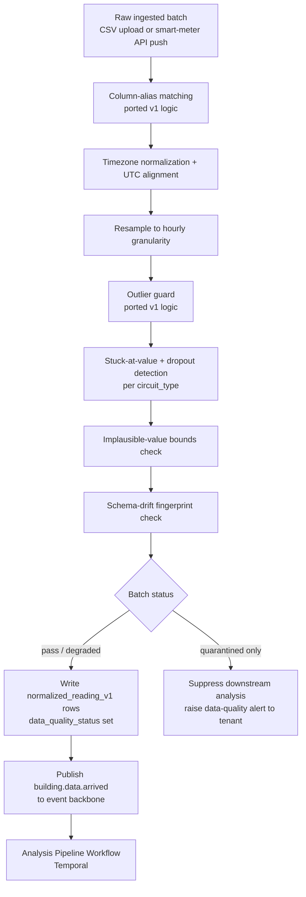
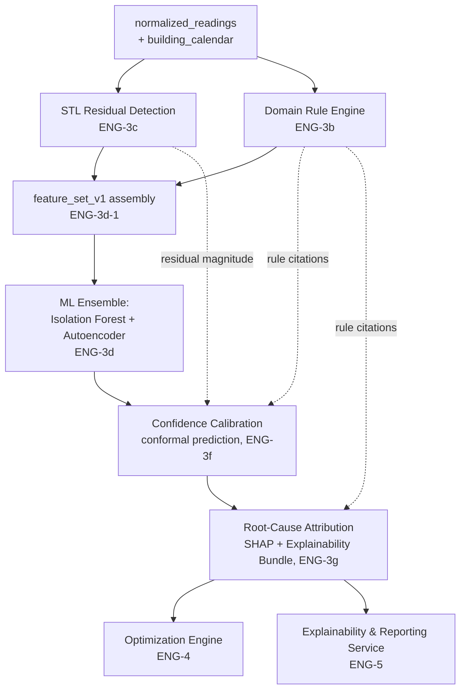
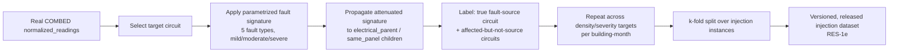
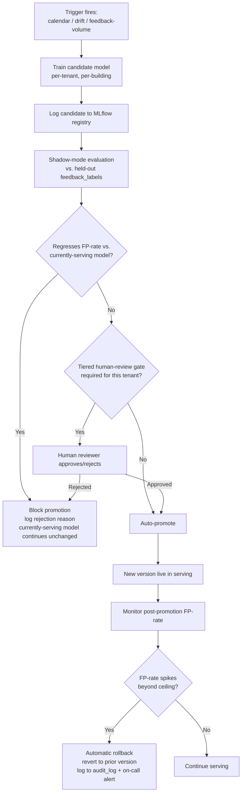
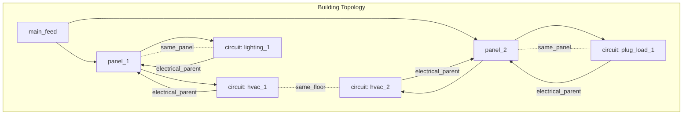

# CarbonSense — Data & Model Strategy

**Version:** 1.0
**Status:** Active — Engineering & Research Reference
**Source of Truth:** PRD_v2.md, TRD_v2.md, ROADMAP_v2.md, REPOSITORY_STRUCTURE_TRACK1.md
**Audience:** ML Engineers, Data Engineers, Research Engineers implementing ENG-3, ENG-4, RES-1, and RES-2 onward
**Document Owner:** ML/Data Engineering

---

## How to read this document

Every claim below is traceable to one of the four source documents, cited inline as
`PRD §x`, `TRD §x`, `ROADMAP §x`, or `REPO §x`. Where this document proposes a default,
threshold, or design decision **not yet specified** in those documents, it is marked
explicitly as:

> **PROPOSED (not yet ratified):** *<the recommendation>* — confirm with ML
> Lead/Product before locking into code.

Do not treat a PROPOSED item as settled spec. Treat everything else as binding.

This document does not re-derive the architecture — `TRD_v2.md §3` and `§8` remain the
authoritative description of *what each layer must guarantee*. This document answers
the question those sections deliberately leave open: **which data, exactly, feeds
which model, with which features, producing which labels, evaluated how.**

---

## 1. Dataset Strategy

| Dataset | Provider / Source | Purpose | Used By (Epic) | Status / Constraint |
|---|---|---|---|---|
| **COMBED** (IIT Delhi instrumented building) | Public research dataset | Training (offline), validation (golden fixture), research training + evaluation substrate | `ENG-3a`–`3h` (golden fixture, `TRD §11.1`), `RES-1`–`RES-4` (primary research dataset) | **One building, 200+ submeter circuits, ~1 month of data** — a permanent structural fact, not a temporary gap (`TRD §2.4`, `§7.4`). No real fault ground truth exists in it. |
| **ETH Zurich ECO** | Public research dataset | Optional secondary validation / cross-building sanity-check; candidate NILM-style pretraining corpus | Not a named v2 product requirement | `PRD_v2.md`'s own Migration Map explicitly removed ECO as a fixed v2 requirement in favor of a source-agnostic data architecture. **Open decision, flagged here, not resolved in TRD/PRD:** does the research track want ECO as a second pretraining/validation source alongside REDD/UK-DALE/Dataport, or is it dropped entirely? See §9 and the gap appendix. |
| **NILM transfer-learning corpora** (REDD, UK-DALE, Dataport) | Public research datasets | Research-only: pretrain the GNN encoder before COMBED fine-tuning | `RES-3d` | Addresses the generalization-risk mitigation named in `TRD §8.4`. Not used in production inference. |
| **Weather data** (temperature, HDD/CDD) | Abstracted **Weather Provider** interface (e.g., a public weather API) | Feature engineering: HVAC-inefficiency rule input, `feature_set_v1` enrichment | `ENG-3b` (rule context), `ENG-3d-1` (`feature_set_v1`) | `TRD_v2.md` deliberately does not name a fixed weather vendor — see `PRD` Migration Map's "source-agnostic" instruction. Implement behind an interface so the vendor is swappable without touching detection logic. |
| **Solar irradiance data** | Abstracted **Solar Provider** interface (e.g., a public solar-resource API) | Optimization Engine `solar_offset_v1` scenario input | `ENG-4b` | Same source-agnostic treatment as weather. |
| **Holiday / occupancy calendar** | `building_calendar` table — holiday-API import + customer-uploaded closures | Day-type conditioning for STL decomposition; rule-engine occupancy context | `ENG-1d`, `ENG-3c-1`, `ENG-3b` | First-class, hard requirement in v2 (`TRD §3.3`) — not deferred, unlike v1. |
| **Grid carbon intensity** | Abstracted **Carbon Intensity Provider** interface | Optimization Engine emissions calculations (baseline vs. optimized kg CO₂) | `ENG-4` | `TRD §4`'s scenario contract requires `baseline_emissions_kg_co2`/`optimized_emissions_kg_co2`; the specific provider (e.g., a real-time grid-intensity API with a static-factor fallback) is an implementation choice behind this interface, not pinned in TRD. |
| **Synthetic fault-injection dataset** | Generated, derived from real COMBED time series | Research-only labeled dataset: GNN supervised training + the baseline-vs-GNN comparison | `RES-1` (generation), `RES-2`–`RES-4` (consumption) | This is the **only labeled localization dataset that exists anywhere in this system** — see §6. Versioned and released per `RES-1e`. |
| **Production tenant data** (`normalized_readings`, `findings`, `feedback_labels`) | Real customer ingestion (CSV / smart-meter API) | Per-tenant/per-building model training, calibration sets, retraining triggers | `ENG-3d`, `ENG-3f`, `ENG-3h`, `ENG-6` | Starts empty for every new building (cold-start, `TRD §2.4`) and grows only through real usage — see §6 and §8. |
| **De-identified cross-tenant aggregates** | Derived from production data, consented tenants only | Cold-start prior seeding (building-type/climate-zone clusters) | `ENG-1d` topology, `ENG-3h-3`, `TRD §2.4` | **Aggregate statistics only, never raw rows** — the opt-in + audit-logged-check mechanism in `TRD §3.8` is the only lawful path for any cross-tenant data flow in this system. |

---

## 2. Dataset-to-Model Mapping

| Model | Dataset(s) | Features Consumed | Labels | Output | Retraining / Recompute Cadence |
|---|---|---|---|---|---|
| **Domain Rule Engine** (`ENG-3b`) | `normalized_readings` + building metadata + `building_calendar` | Declared occupancy schedule, raw/derived `kwh`, day-type | None (deterministic rules, not learned) | Rule-fired findings + `rule_id`/version citation | Rules change via reviewed PR + version bump (`TRD §3.2`) — never "retrained" |
| **STL Residual Detection** (`ENG-3c`) | `normalized_readings` + `building_calendar` | Trend/seasonal/residual decomposition inputs, day-type | None (unsupervised decomposition) | Residual z-score per reading; STL-derived fields into `feature_set_v1` | Re-fit per analysis window, not a persisted trained artifact |
| **Isolation Forest** (`ENG-3d`) | `feature_set_v1` (golden COMBED fixture offline; per-tenant production data live) | Rolling stats, STL residuals, calendar features, rule-fire indicators | None at training time (unsupervised). `feedback_labels` used only for **evaluation** and **retraining-trigger volume**, never as a direct training target | Anomaly score | Scheduled per-tenant/per-building (`ENG-3d-2`); triggers in §8 |
| **Windowed Autoencoder** (`ENG-3d`) | `feature_set_v1`, windowed sequences | Same as above, windowed | None (reconstruction target = input itself) | Reconstruction-error score | Scheduled per-tenant/per-building (`ENG-3d-3`) |
| **Drift Detection — Mann-Kendall** (`ENG-3e`) | Rolling efficiency ratio (actual ÷ model-predicted baseline) | Time series of the efficiency ratio | None (nonparametric trend test) | `drift_status` (`stable`/`drifting`) + trend magnitude | Nightly scheduled cron, outside the request path (`TRD §3.5`) |
| **Confidence Calibration — Conformal Prediction** (`ENG-3f`) | ML Ensemble scores + STL residuals + rule-fire context + per-building rolling calibration set | Nonconformity scores derived from upstream layers | `feedback_labels` (confirmed/dismissed) as the calibration ground truth | Calibrated confidence interval per finding | Rolling refresh as the calibration set updates (`ENG-3f-2`) |
| **SHAP Explainer** (`ENG-3g`) | ML Ensemble's trained model + its feature inputs | `feature_set_v1` | None (post-hoc explainability — no separate training) | `top_features` with SHAP values + plain-language description | Computed per finding at inference time; no training artifact |
| **GCN** (`RES-3b`, baseline ablation) | COMBED topology + `RES-1` injection labels | Per-node `feature_set_v1` outputs (reused from production, not recomputed) | Injected fault-source circuit (binary per-node label) | Per-node fault-source probability | One-off per research experiment/ablation run |
| **GAT** (`RES-3c`, primary candidate) | COMBED topology + `RES-1` injection labels + NILM pretraining corpora (`RES-3d`) | Same node features + heterogeneous edge types (`electrical_parent`, `same_panel`, `same_floor`) | Injected fault-source circuit | Per-node fault-source probability + attention weights (interpretability signal) | Pretrain (NILM) → fine-tune (COMBED) per `RES-3c`/`RES-3d`; periodic retrain only if/when promoted to production (`PRD §7.5`) |

---

## 3. Feature Engineering

Organized by category. **Source** names the upstream system; **Consumed By** names the
downstream layer(s)/model(s) — match these against `REPO`'s service boundaries
(`services/*`, `models/feature_store/`) when implementing.

### 3.1 Raw Features

| Feature | Source | Transformation | Consumed By |
|---|---|---|---|
| `raw_kwh_reading` | Ingested CSV/API | None (validated, not transformed, by the Data Quality Gate) | Data Quality Gate, all downstream |
| `timestamp` | Ingested data | UTC normalization + timezone alignment (ported v1 logic, `TRD §3.1`) | All layers |
| `circuit_metadata` (`circuit_type`, `panel_id`, `floor`, `parent_circuit_id`) | Onboarding / declared at building setup | None | Domain Rule Engine, GNN graph construction (`RES-3a`) |

### 3.2 Derived (Time-Series) Features

| Feature | Source | Transformation | Consumed By |
|---|---|---|---|
| `hourly_kwh` | `raw_kwh_reading` | Resampling to hourly granularity | `feature_set_v1`, STL |
| `rolling_baseline_kwh` | `hourly_kwh` | Rolling mean (window: **PROPOSED — 7-day and 30-day variants, confirm with ML Lead**) | ML Ensemble, Drift Detection denominator |
| `peak_offpeak_split` | `hourly_kwh` + declared tariff schedule | Bucket by declared peak/off-peak hours | Optimization Engine `load_shift_v1` |
| `after_hours_kwh_ratio` | `hourly_kwh` + occupancy schedule | Ratio of after-hours to in-hours consumption | Domain Rule Engine (`hvac_after_hours_v3`-style rules), SHAP `top_features` |
| `weekend_floor_load` | `hourly_kwh` | Weekend after-hours floor ÷ weekday after-hours baseline | Domain Rule Engine (vampire-load rule) |
| `rolling_efficiency_ratio` | `hourly_kwh` ÷ model-predicted baseline | Ratio over a trailing window | Drift Detection (`ENG-3e-1`) |

### 3.3 Weather Features

| Feature | Source | Transformation | Consumed By |
|---|---|---|---|
| `temperature` | Weather Provider (abstracted, §1) | Time/location lookup | HVAC-inefficiency rule context, `feature_set_v1` |
| `hdd` / `cdd` (heating/cooling degree-days) | `temperature` | Degree-day calculation against a base temperature (**PROPOSED — base temp 18°C, confirm regionally**) | Domain Rule Engine, ML Ensemble |

### 3.4 Solar Features

| Feature | Source | Transformation | Consumed By |
|---|---|---|---|
| `solar_irradiance` | Solar Provider (abstracted, §1) | Location-based lookup | Optimization Engine `solar_offset_v1` |

### 3.5 Occupancy & Calendar Features

| Feature | Source | Transformation | Consumed By |
|---|---|---|---|
| `day_type` (`business_day` / `weekend` / `holiday` / `declared_closure`) | `building_calendar` table (`ENG-1d`) | Calendar join against the reading's date | STL day-type conditioning (`ENG-3c-1`), Domain Rule Engine |
| `declared_occupancy_schedule` | Building metadata (onboarding) | None | Domain Rule Engine after-hours rule |

### 3.6 Carbon Features

| Feature | Source | Transformation | Consumed By |
|---|---|---|---|
| `grid_carbon_intensity_kg_per_kwh` | Carbon Intensity Provider (abstracted, §1) | Time-of-day / region lookup | Optimization Engine emissions calculations (`TRD §4`) |

### 3.7 Circuit-Level Features (the ones that flow into `feature_set_v1` and the research graph)

| Feature | Source | Transformation | Consumed By |
|---|---|---|---|
| `stl_residual_magnitude` | STL Residual Detection | Per `ENG-3c-1` | `feature_set_v1`, ML Ensemble, GNN node features (`RES-3a`) |
| `rule_fire_indicator` (binary, per `rule_id`) | Domain Rule Engine | None | `feature_set_v1`, ML Ensemble, GNN node features |
| `ml_ensemble_anomaly_score` | Isolation Forest + Autoencoder | None | Confidence Calibration, SHAP, GNN node features |
| `circuit_topology` (`parent_circuit_id`, `panel_id`, `floor`) | Canonical schema (`ENG-1a`) | Graph edge construction | GNN graph (`RES-3a`) — **this is the literal field set the research track reuses; do not recompute it separately, per `ROADMAP §5`'s cross-track dependency table** |

### 3.8 Building-Level Features

| Feature | Source | Transformation | Consumed By |
|---|---|---|---|
| `building_type`, `climate_zone` | Onboarding metadata | None | Cold-start prior clustering (`TRD §2.4`), per-building-type drift sensitivity (`TRD §12`) |
| `cold_start` flag | `buildings` table | Set/cleared by the exit-criterion logic in §8 | Confidence Calibration default behavior, Domain Rule Engine weighting |

**`feature_set_v1` is the versioned contract** (`ENG-3d-1`) that bundles Sections 3.2,
3.3, 3.5, and 3.7's outputs into the single feature row the ML Ensemble, Confidence
Calibration, and (by direct reuse) the GNN research track all consume. It lives
conceptually under `models/feature_store/` per `REPO`'s repository structure — define
it once there, do not let any service maintain its own divergent copy.

---

## 4. Data Preprocessing

### 4.1 What's handled, and where

| Problem | Mechanism | Owning Component |
|---|---|---|
| Missing values / gaps | Ported v1 gap-handling rules: interpolate only within a bounded gap duration; beyond that, mark `quarantined` rather than interpolate across an unknown gap | Data Quality Gate (`ENG-3a-1`) |
| Outliers | Ported v1 outlier-guard logic | Data Quality Gate (`ENG-3a-1`) |
| Sensor faults — stuck-at-value | Rolling-window variance ≈ 0 over a duration threshold, calibrated per `circuit_type` | Data Quality Gate (`ENG-3a-2`) |
| Sensor faults — dropout | Gap duration vs. expected reporting interval (source-dependent: API push interval vs. CSV export granularity) | Data Quality Gate (`ENG-3a-2`) |
| Implausible values | Versioned, per-`circuit_type` min/max bounds table, editable without redeploy | Data Quality Gate (`ENG-3a-3`) |
| Schema drift | Column-hash/type fingerprinting on each new ingestion source | Data Quality Gate (`ENG-3a-3`) |
| Time alignment | UTC normalization, timezone alignment, hourly resampling (ported v1 logic) | Data Quality Gate (`ENG-3a-1`) |
| Feature scaling | **PROPOSED, not specified in TRD:** Standardize (z-score) numeric features **per building, not globally** — consumption magnitude varies enormously building to building, and a global scaler would let a large building's scale dominate a small building's anomaly sensitivity. Fit and persist the scaler alongside each building's model version in the registry (`ENG-6a`), so it travels with the model it was fit for. | ML Ensemble training pipeline (`ENG-3d`) |

### 4.2 Data Preprocessing & Quality Gate Pipeline

### 4.3 Feature Computation & Detection-Layer Ordering

This is the order layers actually consume each other's output — get this wrong and a
layer will silently run on stale or missing context (e.g., STL must run before the ML
Ensemble, because the Ensemble's `feature_set_v1` input includes STL residuals).

### 4.4 Quality Checks Before a Finding Ever Reaches a User

Per `TRD §3` cross-layer requirement: a finding is not surfaced until it has passed
through every relevant layer above. The practical implication for implementation: **no
service should write directly to `findings` without going through the
Explainability Bundle assembler** (`ENG-3g-2`) — a finding with no bundle is, by
definition, not yet trustworthy enough to show a user, regardless of which layer
produced the raw signal.

---

## 5. Model Strategy

### 5.1 Isolation Forest

| | |
|---|---|
| **Inputs** | `feature_set_v1` rows (rolling stats, STL residuals, calendar features, rule-fire indicators) |
| **Outputs** | Per-window anomaly score |
| **Training** | Unsupervised, per-tenant/per-building, scheduled Temporal workflow (`ENG-3d-2`); artifact logged to MLflow under `models:/{tenant_id}/{building_id}/ml_ensemble/{version}` |
| **Inference** | Served by the lightweight model-serving microservice (`ENG-3d-4`), loading the currently-promoted version per building |
| **Strengths** | Cheap to train and score; catches global statistical outliers without needing a learned baseline beyond the current window; robust to the high dimensionality of `feature_set_v1` |
| **Limitations** | Insensitive to *shape*-level anomalies (a circuit whose individual readings are within normal bounds but whose pattern over a window is abnormal) — this is exactly why the Autoencoder exists alongside it (`TRD §3.4`'s explicit "blind spots don't overlap" guarantee). Contamination parameter (**PROPOSED default: 5%, confirm empirically per building type**) directly trades precision against recall and should not be left at a library default without validation against the golden fixture. |

### 5.2 Windowed Autoencoder

| | |
|---|---|
| **Inputs** | `feature_set_v1`, windowed into sequences (**PROPOSED window length: 24–48 hours, confirm against COMBED's actual anomaly duration characteristics**) |
| **Outputs** | Reconstruction-error score per window |
| **Training** | Unsupervised (reconstruction target = the input itself), per-tenant/per-building, scheduled (`ENG-3d-3`) |
| **Inference** | Same serving microservice as Isolation Forest (`ENG-3d-4`) |
| **Strengths** | Catches pattern-level/shape anomalies Isolation Forest misses; the reconstruction-error framing degrades gracefully (a "slightly odd" window scores moderately, not as a hard binary) |
| **Limitations** | More expensive to train than Isolation Forest; needs more history to train a meaningful reconstruction baseline, which directly compounds the cold-start problem (§8) — a brand-new building's Autoencoder is the least reliable signal in the ensemble during the cold-start window. |

### 5.3 STL Residual Detection

| | |
|---|---|
| **Inputs** | `normalized_readings` time series, `building_calendar` |
| **Outputs** | Residual z-score per reading; STL-derived fields feeding `feature_set_v1` |
| **Training** | Not a persisted trained model — decomposition is re-fit per analysis window (`statsmodels.tsa.seasonal.STL`) |
| **Inference** | Computed inline as part of every analysis run (`ENG-3c-1`) |
| **Strengths** | Calendar-aware: a holiday is not scored as an anomalous low-consumption day, which a naive raw-value threshold would get wrong |
| **Limitations** | Needs enough history to establish a meaningful trend/seasonal decomposition — another cold-start-sensitive layer; a decomposition fit on too little data can produce unstable residuals that look like noise rather than signal. |

### 5.4 Drift Detection — Mann-Kendall Trend Test

| | |
|---|---|
| **Inputs** | Rolling efficiency ratio (actual ÷ model-predicted baseline) per building |
| **Outputs** | `drift_status` (`stable`/`drifting`) + trend direction/magnitude |
| **Training** | None — a nonparametric statistical test, not a learned model |
| **Inference** | Scheduled nightly cron, explicitly outside the real-time request path (`ENG-3e-1`) |
| **Strengths** | Detects slow, monotonic shifts (renovation, occupancy change, equipment swap) that a single-window anomaly detector would never catch, since each individual reading along a slow drift can look locally normal |
| **Limitations** | Not designed to catch sudden step-change faults (that's the ML Ensemble's and Domain Rule Engine's job) — drift detection and anomaly detection are deliberately separate concerns; do not conflate them in a single model. |

### 5.5 Confidence Calibration — Conformal Prediction

| | |
|---|---|
| **Inputs** | ML Ensemble scores, STL residual magnitudes, rule-fire context, building's `cold_start` status |
| **Outputs** | Calibrated confidence interval/percentage per candidate finding |
| **Training** | A rolling, per-building calibration set drawn from the building's own most-recent `feedback_labels` (`ENG-3f-2`) — this is *calibration*, not conventional supervised training; there is no separate "model" artifact beyond the calibration set itself and the conformal wrapper logic |
| **Inference** | Wraps every candidate finding before it's eligible to reach `findings` |
| **Strengths** | Statistically grounded uncertainty, not an arbitrary score; degrades honestly (wide bands) rather than confidently when data is thin |
| **Limitations** | Only as good as the calibration set's size and recency — a building with too few `feedback_labels` cannot produce a tight, trustworthy interval, which is precisely why cold-start buildings default to wide bands (§8) rather than being denied a calibration step entirely. **Minimum calibration-sample threshold is not numerically specified anywhere in TRD/PRD — flagged as an open gap, §11.** |

### 5.6 SHAP Explainer

| | |
|---|---|
| **Inputs** | The trained ML Ensemble model + the `feature_set_v1` row that produced a given score |
| **Outputs** | `top_features` — ranked SHAP values with plain-language descriptions, feeding the Explainability Bundle (`TRD §3.7`) |
| **Training** | None — post-hoc explainability computed against an already-trained model |
| **Inference** | Computed per finding, at the point the Explainability Bundle is assembled (`ENG-3g-1`/`3g-2`) |
| **Strengths** | Model-agnostic, theoretically grounded feature attribution; the plain-language mapping is what makes a finding legible to a facility manager, not just a data scientist |
| **Limitations** | SHAP values explain the ML Ensemble's score specifically — they say nothing about why a *rule* fired (that's `rule_citations`, a separate field in the bundle) or why a *drift* alert fired. Do not present SHAP as "the" explanation for a finding with mixed contributing layers; the bundle's `contributing_layers` field exists exactly to keep this honest. |

### 5.7 GCN (Research Baseline)

| | |
|---|---|
| **Inputs** | COMBED topology (graph) + per-node `feature_set_v1` features, reused directly from production | 
| **Outputs** | Per-node fault-source probability |
| **Training** | Supervised on `RES-1`'s injected fault-source labels, one relation type (edges treated uniformly) |
| **Inference** | Research evaluation only — not served in production |
| **Strengths** | Simple, well-understood, a meaningful "does topology help at all" baseline against the topology-agnostic Isolation Forest/Autoencoder/STL baselines |
| **Limitations** | Cannot natively exploit the heterogeneous edge structure (`electrical_parent` vs. `same_panel` vs. `same_floor`) without a relation-aware variant — this is precisely why GAT, not GCN, is the primary candidate (`TRD §8.3`). |

### 5.8 GAT (Research Primary Candidate)

| | |
|---|---|
| **Inputs** | Same as GCN, plus the heterogeneous multi-relational edge types, plus (for `RES-3d`) NILM-pretrained encoder weights |
| **Outputs** | Per-node fault-source probability + per-prediction attention weights |
| **Training** | Pretrain on NILM corpora (`RES-3d`) → fine-tune on COMBED's topology with `RES-1` injection labels (`RES-3c`/`3e`) |
| **Inference** | Research evaluation; if it clears the publishable bar and a meaningful localization improvement (`PRD §7.5`), it becomes a **candidate addition** to Root-Cause Attribution (`ENG-3g`) for tenants with sufficiently rich submeter topology — not a default replacement for SHAP-on-the-ML-Ensemble |
| **Strengths** | Attention weights double as an interpretability signal (which neighboring circuits' anomaly evidence most influenced the localization) — the one architecture in this catalog whose accuracy and explainability needs are served by the same mechanism |
| **Limitations** | Parameter count (`TRD §8.3`: ~50K–200K at this scale) keeps overfitting risk manageable but does not eliminate the underlying single-building generalization risk (`TRD §7.4`) — the NILM pretraining step exists specifically to soften this, not to solve it outright; the write-up must state this honestly (`PRD §7.3`'s honest-reporting requirement). |

---

## 6. Labeling Strategy

### 6.1 The central fact this whole section exists to make explicit

**There is no real ground-truth fault/anomaly label anywhere in this system.**
COMBED has no labeled faults (`TRD §7.4`). Production `feedback_labels` (confirm/dismiss)
are a *human trust signal*, not a ground-truth fault label — a facility manager
confirming a finding means "I believe this," not "this is mechanically verified as a
true fault." Treat these as two structurally different kinds of label and never let
one substitute for the other in a model that needs the other.

| Label type | Exists today? | Source | Used for |
|---|---|---|---|
| Real, mechanically-verified fault ground truth | **No — does not exist** | — | Nothing. This is the gap the whole synthetic-injection methodology (§9) exists to work around. |
| `feedback_labels` (confirmed/dismissed) | Yes, but sparse pre-pilot; grows through real usage | Facility manager action in the primary review workflow (`ENG-3h-1`) | Confidence Calibration's calibration set (`ENG-3f-2`); false-positive-rate evaluation and promotion gating (`ENG-6c`); retraining-eligibility volume trigger (`ENG-3h-2`); **never** a direct supervised-training target for Isolation Forest/Autoencoder, both of which remain unsupervised methods |
| Synthetic fault-injection labels | Generated, not collected | `RES-1`'s injection pipeline, applied to real COMBED time series | The **only** supervised training/evaluation labels for the GNN research track (§9); the basis for the entire baseline-vs-GNN comparison (`RES-2`–`RES-4`) |

### 6.2 Ground-Truth Creation via Synthetic Fault Injection

This is `RES-1`, and it is the load-bearing prerequisite for everything in Track 2
(`ROADMAP §5`: "**Blocks.** No labeled localization signal exists for GNN
training/evaluation until the injection methodology... is complete"). Full
methodology lives in `TRD §8.4`; the labeling-relevant summary:

- **Fault taxonomy** (5 types): sensor stuck-at-value, sensor dropout, gradual
  degradation, sudden step-change overconsumption, intermittent flicker fault.
- **Propagation modeling**: a fault injected at a circuit propagates an attenuated
  version of its signature to electrically related child circuits, per the real
  topology (`parent_circuit_id`/`panel_id`). **This is what makes the label a
  localization label, not just an anomaly label** — without propagation, every
  topology-agnostic method would perform identically to a topology-aware one, because
  there'd be no structural ambiguity to resolve.
- **Density/severity calibration**: controlled injection density per building-month,
  spanning mild/moderate/severe severity, to avoid both fault-saturation and
  too-few-instances-for-significance.
- **Split strategy**: k-fold over **injection instances**, not circuits, not time
  windows alone — preventing a circuit's "normal" signature from appearing in both
  train and test for the same instance.
- **Versioning**: the injection code and generated dataset are versioned and prepared
  for public release (`RES-1e`).

---

## 7. Evaluation Framework

### 7.1 Production Metrics

| Metric | Measured Against | Threshold | Owning Mechanism |
|---|---|---|---|
| False-positive rate | Golden COMBED fixture (regression) + per-tenant `feedback_labels` (live) | **Ceiling not yet numerically set** — `PRD §8.4` explicitly defers this to a joint Product/Engineering decision; flagged as an open gap in `TRD` Appendix B | Promotion gate (`ENG-6c`) |
| Precision / Recall | Golden fixture + pilot confirmed/dismissed labels | No fixed target asserted in PRD/TRD; track and report, do not gate on an unvalidated number | `GTM-2a` (real-world validation) |
| Detection latency | Per TRD's differentiated targets | Real-time API path: < 5 min from data arrival to findings; batch CSV path: < 15 min (`TRD §9.1`) | Pipeline SLO monitoring (`ENG-7b`) |
| Calibration coverage | Conformal prediction's empirical coverage vs. its nominal confidence level | **PROPOSED, not in TRD:** track empirical coverage explicitly (e.g., does a "70–80% confidence" finding turn out correct roughly 70–80% of the time against later-confirmed labels?) — a conformal layer that is well-calibrated in theory but never checked against real outcomes is not actually validated. | New monitoring requirement — recommend adding to `ENG-6e`'s scope |
| Drift detection sensitivity/specificity | Simulated known regime shifts in test data + real pilot building behavior over time | Not numerically specified | `ENG-3e`, `GTM-2a` |

### 7.2 Research Metrics (per `TRD §8.5`)

| Method | Precision | Recall | F1 | Top-1 Localization Accuracy | Top-3 Localization Accuracy | AUROC |
|---|---|---|---|---|---|---|
| Isolation Forest | — | — | — | — | — | — |
| Autoencoder | — | — | — | — | — | — |
| STL-residual | — | — | — | — | — | — |
| GCN | — | — | — | — | — | — |
| GAT (proposed) | — | — | — | — | — | — |

*(Table populated with real numbers by `RES-4a`; this is the exact format `RES-4a`'s
DoD requires — do not invent a different reporting shape.)*

**Statistical significance:** paired comparison across injection instances (Wilcoxon
signed-rank test or bootstrap confidence intervals), pre-registered threshold
(**PROPOSED: p < 0.05**), effect size reported alongside point estimates (`TRD §11.2`,
`RES-4b`). **Top-1/Top-3 Localization Accuracy** specifically asks whether the true
injected fault-source circuit is the model's highest-ranked (or top-3) candidate among
all circuits flagged anomalous in that instance — this is the metric that actually
operationalizes the topology-aware localization claim; precision/recall alone only ask
whether *some* anomaly was flagged, not whether the *right circuit* was identified.

### 7.3 Product KPIs vs. Research KPIs — Kept Structurally Separate

Per `PRD §8.4` vs. `§8.5`: production model performance SLAs (false-positive ceiling,
detection latency) are tracked as **ongoing platform-health metrics**, monitored
continuously. Research milestones (venue/timeline, the acceptance-criteria checklist
in `PRD §7.3`) are tracked **against publication standards**, with their own go/no-go
review (`RES-5b`) — do not report research benchmark numbers as if they were a
production SLA, and do not gate a production promotion decision on a research metric
that hasn't cleared its own statistical-significance bar.

---

## 8. Retraining & MLOps

### 8.1 Triggers (per `TRD §6.2`, `ENG-6b`)

| Trigger | Mechanism | Fires Independently? |
|---|---|---|
| Calendar cadence | Default periodic retrain (**PROPOSED: monthly**, confirm cadence with ML Lead) | Yes |
| Drift detection | `model.drift.detected` event from `ENG-3e-2` | Yes |
| Feedback volume | Per-building counter crossing a threshold (**threshold value not numerically specified — open parameter, §11**) | Yes |

### 8.2 Promotion Gate & Rollback

| Stage | Mechanism |
|---|---|
| Registry | MLflow, URI convention `models:/{tenant_id}/{building_id}/{layer}/{version}` (`ENG-6a`) — exact match required, downstream services key off this literal pattern |
| Shadow evaluation | Candidate scored against the building's held-out `feedback_labels` set **before** promotion; must not regress false-positive rate vs. the currently-serving model (`ENG-6c`) |
| Human review gate | Tiered: applies to a tenant's first N promotions, with tier-dependent strictness (freemium vs. enterprise) | 
| Rollback | Automatic; fires on a post-promotion false-positive-rate spike within a monitoring window, reverts to the prior version, logs to `audit_log`, triggers an on-call alert (`ENG-6d`) |
| Silent-degradation monitoring | Aggregate **output**-distribution drift across the tenant base (distinct from the **input**-distribution drift in §5.4) — catches a model that's technically running but has started scoring systematically differently (`ENG-6e`) |

### 8.3 Retraining & Promotion Lifecycle

### 8.4 Cold-Start Handling in the Retraining Lifecycle

A building's first training cycle has no prior `feedback_labels` to shadow-evaluate
against. **PROPOSED, not specified in TRD:** a brand-new building's first promotion
should skip the false-positive-regression check (there is no prior version to regress
against) but still pass through the human-review gate unconditionally, regardless of
tenant tier, until its calibration set clears the minimum-sample threshold referenced
in §5.5 and §11. This closes a gap TRD's promotion-gate description doesn't explicitly
address: a "regression check against nothing" is not a meaningful gate.

---

## 9. Research Dataset Strategy

### 9.1 Graph Construction (`TRD §8.2`, `RES-3a`)

- **Nodes:** submeter circuits — COMBED provides 200+.
- **Node features:** reused directly from production's `feature_set_v1` (rolling
  stats, STL residual magnitude, ML Ensemble score, rule-fire indicator) — **the
  research track does not recompute features from raw time series**; this is the
  explicit point of architectural reuse (`TRD §8.2`).
- **Edges (heterogeneous, multi-relational):**
  - `electrical_parent` — direct distribution hierarchy (`parent_circuit_id`)
  - `same_panel` — shared `panel_id`
  - `same_floor` — shared `floor` (spatial proximity, weaker signal)

### 9.2 Synthetic Faults

Covered in full in §6.2 — the injection taxonomy, propagation modeling, and
split strategy are identical artifacts whether viewed from a labeling lens (§6) or a
research-dataset lens (here). Do not build two separate injection pipelines.

### 9.3 GNN Datasets

| Dataset | Role |
|---|---|
| COMBED topology + features | The evaluation substrate — one building's real structure and real (non-injected) signal |
| `RES-1` synthetic fault-injection dataset | The supervised labels — what the GNN is actually trained/evaluated against |
| NILM pretraining corpora (REDD, UK-DALE, Dataport) | Pretrain the GNN encoder before COMBED fine-tuning, reducing single-building overfitting risk (`RES-3d`, `TRD §8.4`) |

### 9.4 Ablation Studies

| Ablation | Question Answered | Status |
|---|---|---|
| GCN vs. GAT (`RES-3b` vs. `RES-3c`) | Does relation-aware attention beat a relation-naive graph baseline? | In Roadmap |
| With/without NILM pretraining (`RES-3d`) | Does transfer learning meaningfully reduce single-building overfitting? | In Roadmap |
| **PROPOSED, not in Roadmap:** With/without each individual edge type (`same_panel`, `same_floor`, dropping each in turn) | Is the heterogeneous edge structure actually doing work, or would `electrical_parent` alone perform just as well? This directly tests the specific novelty claim (`TRD §8.1`'s "heterogeneous multi-relational graph" framing) rather than just "GNN vs. non-GNN." | **Recommended addition** — not yet in `ROADMAP_v2.md`; flag to Research Lead before `RES-5a`'s literature-review/novelty-positioning pass, since this ablation is the most direct evidence for the specific delta a reviewer will ask about. |

---

## 10. Roadmap Mapping

| Epic / Sub-Epic | Required Dataset(s) | Required Feature(s) | Required Model(s) | Dependency Notes |
|---|---|---|---|---|
| `ENG-3a` Data Quality Gate | Raw ingested batches; per-`circuit_type` bounds table | Raw + time-aligned features (§3.1) | None (deterministic) | First link in the chain — every other `ENG-3` sub-epic depends on its output |
| `ENG-3b` Domain Rule Engine | `normalized_readings`, `building_calendar`, declared occupancy | `after_hours_kwh_ratio`, `weekend_floor_load`, `day_type` | None (rules) | Independent of ML layers — findings don't depend on `ENG-3d` working |
| `ENG-3c` STL Residual Detection | `normalized_readings`, `building_calendar` | `day_type` (depends on `ENG-1d`) | STL decomposition | Must complete before `ENG-3d-1` (`feature_set_v1` needs STL output) |
| `ENG-3d` ML Ensemble | `feature_set_v1` (from `3b`+`3c`), golden COMBED fixture for offline validation | All of §3.2/3.3/3.7 | Isolation Forest, Autoencoder | Depends on `3b`, `3c` completing first |
| `ENG-3e` Drift Detection | `rolling_efficiency_ratio` (derived from ML Ensemble's predicted baseline) | `rolling_efficiency_ratio` | Mann-Kendall | Depends on `ENG-3d` existing (needs a baseline to compute the ratio against) |
| `ENG-3f` Confidence Calibration | ML Ensemble + STL + rule outputs, `feedback_labels` | All upstream `feature_set_v1` fields | Conformal prediction | Depends on `3b`, `3c`, `3d` |
| `ENG-3g` Root-Cause Attribution | ML Ensemble feature inputs + trained model | `feature_set_v1` | SHAP | Depends on `3d` |
| `ENG-3h` Feedback Loop | `findings`, facility-manager confirm/dismiss actions, consented aggregate stats | None directly (consumes findings, not raw features) | None (infrastructure) | Depends on `3g` (needs a real Explainability Bundle to attach feedback to) and `ENG-5b` (Feedback API) |
| `ENG-4` Optimization Engine | Explainability Bundle (`ENG-3g` output), carbon intensity data, solar irradiance data, declared tariff schedule | `peak_offpeak_split`, `grid_carbon_intensity_kg_per_kwh`, `solar_irradiance` | None (LP via `scipy.optimize`) | Hard dependency on `ENG-3g-2`'s bundle existing and matching its exact contract |
| `RES-1` Synthetic Fault Injection | COMBED `normalized_readings`, circuit topology (`ENG-1a` fields) | `circuit_topology` | None (generation methodology) | Depends on `ENG-1a` (topology schema) and `ENG-3a-1` (clean, normalized substrate to perturb) |
| `RES-2` Baseline Model Implementation | `RES-1`'s injection-instance test folds | Reused `feature_set_v1` (no recomputation) | Isolation Forest, Autoencoder, STL — **consumed directly from `ENG-3c`/`ENG-3d`, never reimplemented** | Per `ROADMAP §5`: this is a hard cross-track dependency, not optional reuse |

---

## Appendix: Missing Datasets, Labels, Risks & Assumptions

Consolidated for quick scanning. Every item below is either an explicit gap already
flagged in `TRD_v2.md` Appendix B, or a new gap surfaced by this document.

| Category | Item | Why It Matters | Status |
|---|---|---|---|
| Missing dataset | A second real instrumented building beyond COMBED | Every research conclusion is validated against one building's topology; there is no way, today, to test cross-building generalization on real (non-synthetic) data | Open — `TRD §7.4`, no mitigation beyond synthetic injection + NILM transfer learning |
| Missing dataset | Real-world production smart-meter API ingestion data | `GTM-1b` (pilot onboarding) hasn't run yet — every production-path assumption in this document is currently validated only against the golden COMBED fixture, not real customer data | Open — depends on `ENG-5b` + `GTM-1` |
| Missing dataset / open decision | ETH Zurich ECO's role | PRD v2 dropped it as a named requirement (source-agnostic stance), but it's a plausible secondary NILM-style pretraining/validation source | Open — needs a Product/Research decision, not resolved by either document |
| Missing label | Real, mechanically-verified fault ground truth | The entire research evaluation rests on synthetic injection precisely because this doesn't exist (§6.1) | Permanent structural fact, not a temporary gap — must be stated plainly in any publication (`PRD §7.4`) |
| Missing label | Sufficient `feedback_labels` volume pre-pilot | Confidence Calibration and the false-positive-rate evaluation both need a real calibration set; a brand-new platform has none | Resolves naturally through `GTM-1`/`GTM-3`, but is genuinely absent today |
| Missing parameter | False-positive-rate ceiling (numeric) | Gates every model promotion (`ENG-6c`) but has no value set anywhere in PRD/TRD | Open — `TRD` Appendix B gap #3, joint Product/Engineering decision required |
| Missing parameter | Minimum calibration-sample threshold for cold-start exit | Determines when a building stops defaulting to wide confidence bands | Open — not numerically specified anywhere |
| Missing parameter | Feedback-volume retraining-trigger threshold | Determines how much confirm/dismiss activity triggers an out-of-cycle retrain | Open — not numerically specified anywhere |
| Risk | Single-building generalization risk (research) | A method that works on COMBED's specific electrical topology may not transfer to a materially different building | Mitigated, not eliminated, by propagation-aware injection + NILM pretraining (`TRD §8.4`) |
| Risk | Cold-start unreliability (production) | STL and the ML Ensemble are both genuinely unreliable on a new building until sufficient history accumulates | Architecturally handled (wide bands, Rule Engine primacy) but the *threshold* that ends cold-start is undefined (see above) |
| Risk | Conformal calibration never empirically checked against real-world outcomes | A calibration layer that's theoretically sound but never validated against "did the 70% confidence findings actually turn out right 70% of the time" could be silently miscalibrated | New risk surfaced in this document (§7.1) — recommend adding empirical-coverage tracking to `ENG-6e`'s scope |
| Assumption | Declared occupancy schedules are accurate | The Domain Rule Engine's after-hours rule depends entirely on this; a building with an undeclared or stale schedule will produce systematically wrong rule-fired findings | Not validated anywhere — worth a data-quality check at onboarding, not just at the Data Quality Gate's sensor-level checks |
| Assumption | Weather/solar/carbon-intensity providers can be fully abstracted behind swappable interfaces | TRD/PRD's source-agnostic stance assumes this is a clean abstraction; in practice, provider-specific quirks (coverage gaps, rate limits, regional availability) may leak through | Worth validating with a real provider integration early, not assuming the interface is free |

---

*CarbonSense DATA_AND_MODEL_STRATEGY.md · Built from PRD_v2.md, TRD_v2.md,
ROADMAP_v2.md, and REPOSITORY_STRUCTURE_TRACK1.md · Last updated: June 2026*
